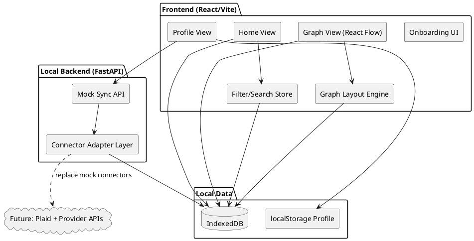
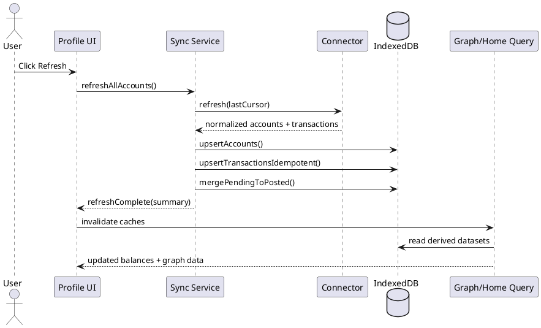
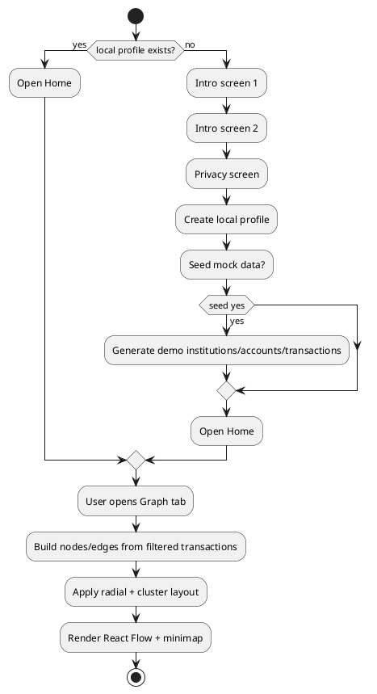

# SpendTrace Localhost Product + Technical Design

## Background
SpendTrace is a localhost-first web app that helps users understand money inflow and outflow through two complementary views:

- Home: simple summaries, category totals, searchable transaction list.
- Graph: Obsidian-style infinite canvas showing how money moves across accounts and transactions.

This design uses the existing project structure:

- Frontend: `/Users/joshuapayes/InfiniteCanvas/InfiniteCanvasMaster/imagination-canvas` (React + Vite + React Flow).
- Backend: `/Users/joshuapayes/InfiniteCanvas/InfiniteCanvasMaster/backend` (FastAPI).

MVP runs fully on a developer machine with local mock data and local profile storage. The architecture keeps interfaces stable so Plaid and a production backend can be added later.

## Requirements (MoSCoW)

### Must have
- Local-first onboarding (3-5 screens) with privacy/security explanation.
- Local profile (name/email) stored on device, no server auth for MVP.
- Bottom tab navigation: Home, Graph, Profile.
- Home view:
  - Spend and income summary for week/month/year.
  - Category totals for FOOD, ESSENTIALS, ACTIVITIES, TRANSPORTATION, MISC.
  - Transaction list with search and filters.
- Graph view using React Flow:
  - Infinite canvas pan/zoom.
  - Minimap + controls.
  - Custom node types: Overall, Account, Transaction, optional Category cluster.
  - Color and size encoding:
    - Red: spending.
    - Yellow: transfers to savings/investing.
    - Green: deposits/income.
    - Size scales by absolute amount.
  - Node click opens detail side panel.
  - Filters: time range, category, account, min/max amount.
  - Search highlighting.
  - Focus mode for account/category subgraph.
- Profile view:
  - Local user info.
  - Connected accounts and status (mock in MVP).
  - Export local data.
  - Delete local data.
  - Privacy summary.
- Sync model for MVP:
  - Manual refresh.
  - Scheduled refresh emulation locally.
  - Dedupe and pending->posted merge rules.

### Should have
- Connector abstraction for account sources:
  - Plaid connector interface.
  - Brokerage connector interface (direct API if possible).
  - CSV import fallback connector.
- Local persistence in IndexedDB (preferred) with migration support.
- Transaction tagging/notes in side panel.
- Graph performance controls for large datasets (collapse/aggregate older transactions).

### Could have
- Timeline scrubber with animated graph updates.
- Saved boards/snapshots per month.
- Canvas annotations and pins.
- Drag transaction nodes into custom groups.
- Side-by-side board comparison (dual React Flow canvases).

### Won't have (MVP)
- Real Plaid Link in production mode.
- Real auth/session backend.
- Multi-user collaboration.
- Bank-grade production security controls (documented for future).

## Method

### 1) Product flow (screens + onboarding journey)

#### App launch
1. Check `localStorage.spendtrace.profile`.
2. If missing, show onboarding carousel (4 screens):
   - Value proposition (where money comes from/goes).
   - Privacy model (local-first, no bank credentials stored).
   - Data controls (export/delete anytime).
   - Profile setup (name/email, optional seed mock data).
3. Save profile and route to Home.

#### Bottom tab navigation
- Home: summaries + categories + transactions.
- Graph: infinite canvas + filter/search + side panel.
- Profile: user info + account status + export/delete.

#### Account and data lifecycle (MVP local)
1. User selects Add Account in Profile.
2. Choose source type:
   - Mock Bank.
   - Mock Brokerage.
   - CSV Import.
3. Connector produces normalized account/transaction records.
4. Sync engine upserts records with dedupe/merge logic.
5. Home and Graph derive state from normalized store.

#### Real system later
- Replace mock connector with Plaid Link flow and server token exchange.
- Keep same normalized schema and sync pipeline.

### 2) Localhost architecture

#### MVP runtime architecture
- Frontend (React/Vite): UI, graph rendering, filter/search, local profile.
- Local data layer (IndexedDB + localStorage): profile, accounts, transactions, graph snapshots.
- FastAPI backend: optional local API for mock sync jobs and connector emulation.
- Scheduler: browser `setInterval` and manual refresh actions.

#### Existing code reuse plan
- Keep React Flow canvas foundation from:
  - `/Users/joshuapayes/InfiniteCanvas/InfiniteCanvasMaster/imagination-canvas/src/Components/Canvas.tsx`
- Replace current demo node palette with SpendTrace graph domain nodes.
- Keep backend service skeleton from:
  - `/Users/joshuapayes/InfiniteCanvas/InfiniteCanvasMaster/backend/main.py`
  - Add `/sync`, `/accounts`, `/transactions`, `/export` endpoints for local mode.

#### Future backend option
- API service (FastAPI or Node), worker, encrypted token store, relational DB.
- Plaid processor for item/account/transaction sync.
- Event log for auditability and idempotent replay.

### 3) Data model + schema

#### Core domain entities (logical)
- UserProfile: local identity + preferences.
- Institution: bank/brokerage provider metadata.
- Account: financial account with balances and type.
- Transaction: immutable financial event with status transitions.
- Category: canonical category set.
- GraphNode / GraphEdge: view model for React Flow.
- SnapshotBoard: saved layout state and filters.

#### TypeScript interfaces (frontend)
```ts
export type CategoryCode =
  | "FOOD"
  | "ESSENTIALS"
  | "ACTIVITIES"
  | "TRANSPORTATION"
  | "MISC";

export type MoneyDirection = "SPEND" | "TRANSFER" | "INCOME";

export interface UserProfile {
  id: string;
  name: string;
  email: string;
  createdAt: string;
  currency: string;
  timezone: string;
}

export interface Institution {
  id: string;
  name: string;
  provider: "MOCK" | "PLAID" | "DIRECT" | "CSV";
  status: "CONNECTED" | "NEEDS_RELINK" | "DISCONNECTED";
}

export interface Account {
  id: string;
  institutionId: string;
  name: string;
  subtype: "CHECKING" | "SAVINGS" | "CREDIT" | "BROKERAGE" | "OTHER";
  mask?: string;
  currentBalance: number;
  availableBalance?: number;
  currency: string;
  status: "ACTIVE" | "INACTIVE";
  lastSyncedAt?: string;
}

export interface Transaction {
  id: string;
  accountId: string;
  externalId?: string;
  date: string;
  merchant: string;
  amount: number;
  direction: MoneyDirection;
  category: CategoryCode;
  pending: boolean;
  postedAt?: string;
  dedupeHash: string;
  tags: string[];
  notes?: string;
  updatedAt: string;
}

export interface GraphSnapshot {
  id: string;
  name: string;
  month: string;
  nodePositions: Record<string, { x: number; y: number }>;
  filters: {
    dateFrom?: string;
    dateTo?: string;
    accountIds: string[];
    categories: CategoryCode[];
    minAmount?: number;
    maxAmount?: number;
  };
  createdAt: string;
}
```

#### SQL-ready schema (future backend)
```sql
CREATE TABLE users (
  id UUID PRIMARY KEY,
  email TEXT UNIQUE NOT NULL,
  name TEXT NOT NULL,
  timezone TEXT NOT NULL,
  created_at TIMESTAMPTZ NOT NULL DEFAULT NOW()
);

CREATE TABLE institutions (
  id UUID PRIMARY KEY,
  user_id UUID NOT NULL REFERENCES users(id),
  provider TEXT NOT NULL,
  external_item_id TEXT,
  name TEXT NOT NULL,
  status TEXT NOT NULL,
  created_at TIMESTAMPTZ NOT NULL DEFAULT NOW(),
  updated_at TIMESTAMPTZ NOT NULL DEFAULT NOW()
);

CREATE TABLE accounts (
  id UUID PRIMARY KEY,
  institution_id UUID NOT NULL REFERENCES institutions(id),
  external_account_id TEXT,
  name TEXT NOT NULL,
  subtype TEXT NOT NULL,
  mask TEXT,
  currency TEXT NOT NULL,
  current_balance NUMERIC(14,2) NOT NULL,
  available_balance NUMERIC(14,2),
  status TEXT NOT NULL,
  last_synced_at TIMESTAMPTZ,
  created_at TIMESTAMPTZ NOT NULL DEFAULT NOW(),
  updated_at TIMESTAMPTZ NOT NULL DEFAULT NOW()
);

CREATE TABLE transactions (
  id UUID PRIMARY KEY,
  account_id UUID NOT NULL REFERENCES accounts(id),
  external_transaction_id TEXT,
  pending_transaction_id TEXT,
  merchant TEXT NOT NULL,
  amount NUMERIC(14,2) NOT NULL,
  direction TEXT NOT NULL,
  category_code TEXT NOT NULL,
  pending BOOLEAN NOT NULL DEFAULT FALSE,
  date DATE NOT NULL,
  posted_at TIMESTAMPTZ,
  dedupe_hash TEXT NOT NULL,
  notes TEXT,
  tags JSONB NOT NULL DEFAULT '[]'::jsonb,
  created_at TIMESTAMPTZ NOT NULL DEFAULT NOW(),
  updated_at TIMESTAMPTZ NOT NULL DEFAULT NOW(),
  UNIQUE(account_id, dedupe_hash)
);

CREATE TABLE graph_snapshots (
  id UUID PRIMARY KEY,
  user_id UUID NOT NULL REFERENCES users(id),
  name TEXT NOT NULL,
  month TEXT NOT NULL,
  node_positions JSONB NOT NULL,
  filters JSONB NOT NULL,
  created_at TIMESTAMPTZ NOT NULL DEFAULT NOW()
);
```

### 4) Graph layout approach using React Flow + custom nodes

#### Node types
- `overallNode`: central user/overall financial node.
- `accountNode`: one per account.
- `transactionNode`: one per transaction.
- `categoryClusterNode` (optional): one per category.

#### Edge model
- Overall -> Account edges.
- Account -> Transaction edges.
- Optional Transaction -> Category edges when cluster mode enabled.

#### Visual mapping
- Color by `direction`:
  - SPEND red (`#ef4444`)
  - TRANSFER yellow (`#eab308`)
  - INCOME green (`#22c55e`)
- Node size:
  - `radius = base + sqrt(abs(amount)) * scale`, clamped for readability.

#### Layout algorithm
1. Place Overall node at `(0,0)`.
2. Place Account nodes on radial ring around Overall:
   - Angle = `2pi * index / accountCount`
   - Radius = `R_accounts` (dynamic by account count)
3. Define fixed category anchors on outer ring.
4. For each transaction node:
   - Base position near owning Account node.
   - Apply bias vector toward category anchor.
   - Add jitter for visual separation.
   - Run collision pass with grid bucketing and push-away iterations.
5. Persist user-dragged positions in local snapshot.

#### Pseudocode
```ts
function layoutGraph(data: GraphInput): LayoutResult {
  placeOverall();
  placeAccountsRadially();
  if (clusterMode) placeCategoryAnchors();

  for (const tx of transactions) {
    const accountPos = accountPosById[tx.accountId];
    const categoryPos = categoryAnchorByCode[tx.category];
    const p = accountPos
      .add(randomInCircle(40))
      .add(vectorToward(accountPos, categoryPos).scale(0.35));
    setTxPos(tx.id, p);
  }

  resolveCollisions(nodes, { iterations: 8, minGap: 14 });
  return buildReactFlowNodesEdges(nodes);
}
```

### 5) Connector system and sync strategy

#### Connector interface
```ts
interface AccountConnector {
  id: string;
  supportsRealtime: boolean;
  connect(input: unknown): Promise<ConnectResult>;
  refresh(state: ConnectorState): Promise<NormalizedDelta>;
  disconnect(state: ConnectorState): Promise<void>;
}
```

#### Implementations
- `MockConnector` (MVP default).
- `PlaidConnector` (future, production path).
- `BrokerageDirectConnector` (per-provider optional).
- `CsvImportConnector` (fallback always available).

#### Sync rules
- Upsert by `external_transaction_id` when available.
- Else use `dedupe_hash = hash(accountId,date,amount,merchantNormalized)`.
- Pending -> posted merge:
  - Match by `pending_transaction_id` or fuzzy hash window.
  - Preserve user notes/tags.
- Idempotent refresh:
  - Store `lastCursor` per connector/account.
  - Replay-safe upsert semantics.
- Retry strategy:
  - Exponential backoff for transient failures.
  - Mark account status `NEEDS_RELINK` for auth failures.

### 6) Security and privacy model

#### Local MVP
- No bank credentials stored.
- Local profile and data persisted on device only.
- Explicit export and delete operations in Profile.

#### Production target
- Plaid access tokens encrypted at rest (KMS-managed keys).
- Secure server-side token exchange only.
- Audit logs for sync/connect/disconnect events.
- Principle of least privilege for scopes and retention.

### PlantUML diagrams

#### Component diagram


#### Sync sequence (manual refresh)


#### Onboarding + first graph flow


## Implementation plan (steps)

1. Set up app shell and routing
- Add routes for onboarding, home, graph, profile.
- Add bottom tab navigation component.

2. Add local data layer
- Create IndexedDB wrapper and repositories for profile/accounts/transactions/snapshots.
- Add seed/mock generator and migrations.

3. Implement onboarding + local profile
- 4-screen flow with privacy messaging.
- Store profile in localStorage and bootstrap DB.

4. Build Home page
- Summary cards (week/month/year).
- Category totals block.
- Virtualized transaction list with search/filter.

5. Build Graph page with React Flow
- Add custom node components (`overall`, `account`, `transaction`, `categoryCluster`).
- Implement layout engine and filtering pipeline.
- Add side details panel and focus mode.

6. Build Profile page
- Show local user data and connected accounts.
- Implement export JSON/CSV and delete-all operations.

7. Add connector + sync framework
- Implement connector interface and MockConnector.
- Add scheduled + manual refresh.
- Implement dedupe and pending->posted merge logic.

8. Backend alignment (optional for MVP)
- Expand FastAPI with local mock sync endpoints.
- Keep API contracts consistent with future production backend.

9. Hardening and performance
- Batch graph updates.
- Collapsing older transactions into aggregate nodes.
- Add error boundaries and sync retry UI states.

10. Test and release localhost MVP
- Unit tests for layout/dedupe.
- Integration tests for refresh and filtering.
- Demo script and sample dataset.

## Milestones

### Milestone 1: Foundation (Week 1)
- Routing, tab bar, onboarding skeleton, local profile persistence.
- Local DB schema + seed data.

### Milestone 2: Home + Profile (Week 2)
- Home summaries/categories/list with filter/search.
- Profile account list, export, delete.

### Milestone 3: Graph core (Week 3)
- React Flow custom nodes/edges.
- Initial layout algorithm and interaction panel.
- Focus mode and search highlighting.

### Milestone 4: Sync robustness (Week 4)
- Connector interface + MockConnector.
- Manual/scheduled refresh, dedupe, pending->posted transitions.
- Performance pass for large graph datasets.

### Milestone 5: Phase 2 readiness (Week 5)
- Plaid integration scaffolding and backend API contract freeze.
- Snapshot board and timeline prototype.

## Gathering results (metrics + validation)

### Product metrics
- Onboarding completion rate.
- Time-to-first-insight (first account/graph view under 2 minutes).
- Weekly active local sessions.
- Feature usage split: Home vs Graph.

### Data quality metrics
- Duplicate transaction rate after sync.
- Pending->posted merge success rate.
- Category coverage rate (% uncategorized).

### Performance metrics
- Graph render time (P50/P95) for 500/1k/5k nodes.
- Pan/zoom frame stability (target >= 50 FPS for typical dataset).
- Filter apply latency (target < 200 ms for 5k transactions).

### Reliability metrics
- Sync success rate.
- Retry recovery success rate.
- Data export success and integrity checks.

### Validation plan
- Usability tests with 5-10 local users.
- Scenario tests:
  - Multiple institutions.
  - Large transfer-heavy month.
  - Pending-to-posted updates.
  - Relink/disconnect simulation.
- Compare graph insights vs list insights for correctness and trust.

## MVP scope summary
- Local profile, local data, mock connectors, Home + Graph + Profile, React Flow primary UX, export/delete controls.

## Phase 2 roadmap summary
- Real Plaid Link + backend token handling.
- Brokerage direct connectors.
- Timeline animation, board snapshots, annotations, comparison boards.
- Production security and observability stack.
