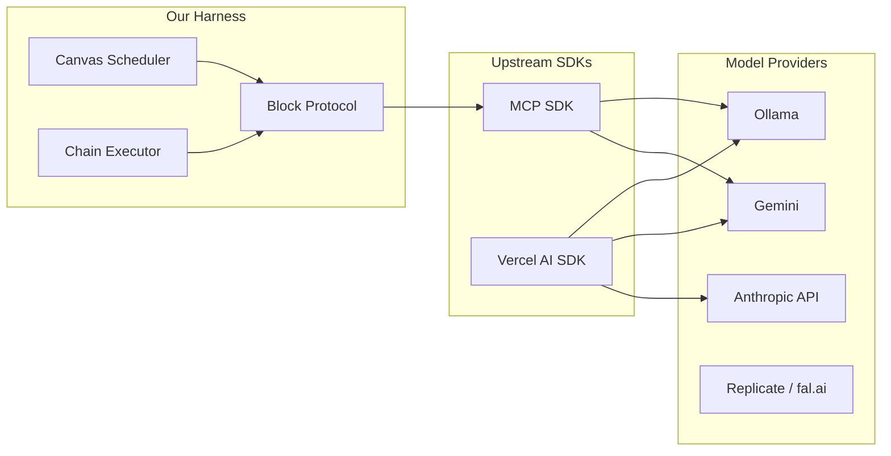

# IEM-MASTER-01 — Capstone Execution Kit

> Addendum to IEM-MASTER-00. Closes six questions raised after its review.
> This document is execution-focused. Where MASTER-00 draws the map, MASTER-01 hands the team the vehicle, the fuel, and the turn-by-turn.

**Document ID:** IEM-MASTER-01
**Status:** Canonical. Extends IEM-MASTER-00. Does not supersede.
**Audience:** Agentic engineering team (first), student team and their CLIs (second).
**Relationship to MASTER-00:** MASTER-00 is the architecture. MASTER-01 is the execution kit. Read MASTER-00 first.

---

## What this addendum answers

Six questions came back from the review of MASTER-00. This document answers them in order.

1. Is Autogen really the agent harness, and should we replace it (with something like Nous Hermes)?
2. Has Surface E been fully spec'd now that its vision is known?
3. Have we explicitly mapped all block types the team will need, across every flow, surface, and outcome?
4. Have we supplied the workflow and PR-merging instructions in a form that lets the student's agent CLI walk them through it?
5. Have we supplied the exterior integrations a workflow canvas requires (calendar, gmail, Notion, Obsidian, etc.)?
6. Have we mapped the full dependency graph the team needs, across backend, frontend, and all surfaces?
7. Can we automate 95% of this flow?

Each Part below answers one of these directly. The Appendices give the reference material the answers cite.

---

## Table of Contents

**Part I — The Agent Harness Decision** (Question 1)
**Part II — Surface E: Scribe** (Question 2)
**Part III — The Exhaustive Block Catalog** (Question 3)
**Part IV — Exterior Integrations** (Question 5)
**Part V — Dependency Atlas** (Question 6)
**Part VI — Automation and the 95%** (Questions 4 and 7)

Appendices
- A. Model Provider Quick-Reference
- B. Public MCP Server Directory
- C. Automation Script Inventory
- D. Agent CLI Session-Opening Protocol

---

# Part I — The Agent Harness Decision

This Part answers: "Autogen is their agent harness correct? Are we making sure this is enhanced and built out, or do we discuss something else that might be more efficient, like Nous Hermes?"

## 1.1 The category clarification

Two layers of the stack got conflated. Unconflate first.

**Autogen** (Microsoft) is an **agent framework**. It sits at the orchestration layer. It tells agents how to talk to each other, how to call tools, how to take turns in a multi-agent conversation. Framework. Python-first.

**Nous Hermes** (Nous Research) is a **model family**. Hermes 2 and Hermes 3 are fine-tunes of Llama and Mistral with strong function-calling behavior. They are excellent models for agent-style workloads. Models. Callable from any framework, including ours, via Ollama or direct inference.

These are not alternatives to each other. They live in different slots. The right way to think about it: Autogen is the car. Hermes is a good engine. You can put Hermes in Autogen. You can put Hermes in any other car. The question "Autogen versus Hermes" is the question "car versus engine," which is a non-question.

The real questions decompose to:

- **Which framework orchestrates our agents?** (Part I.3 below)
- **Which models back our agents?** (Part I.4 below)

Answer the framework question first, because it constrains what the models need to support.

## 1.2 Why Autogen retires

The Autogen exploration in `autogen_exploration/` was real learning. Preserve the learning. Retire the code path. Three reasons:

**Language mismatch.** The repo is 93% TypeScript. The core product is a React web app with a Node backend. Autogen is Python-first. Every time an Autogen flow needs to reach into the canvas, it crosses a language boundary. That boundary is where production complexity goes to metastasize.

**Metaphor mismatch.** Autogen's central metaphor is multi-agent conversation: agents take turns speaking, a group-chat manager decides who speaks next. Our central metaphor is a directed graph of typed, async blocks on a canvas, where edges carry data and the Canvas Scheduler is the orchestrator. Different shape. Forcing one onto the other produces translation tax in every direction.

**Redundancy.** The Block Protocol (MASTER-00 Section 5) plus the Canvas Scheduler (MASTER-00 Section 7.2) already provide orchestration. Adding Autogen on top means we have two orchestration layers trying to coordinate, one in Python, one in TypeScript, over a network boundary. This is the worst kind of complexity: the kind that buys nothing.

The retirement is dignified, not hostile. The `autogen_exploration/` directory gets a `README.md` that explains what was learned, preserves reference implementations of multi-agent patterns, and points forward to how those patterns are realized in the Block Protocol. Nothing gets deleted. Nothing gets extended.

## 1.3 The chosen stack

The harness for this project is three layers of lean, owned code plus two small upstream SDKs.

**Layer 1: Block Protocol** (ours, `@iem/core/block`). Already specified in MASTER-00 Section 5. The typed interface every block implements. The registry. The contract.

**Layer 2: Canvas Scheduler** (ours, `@iem/core/canvas`). Already specified in MASTER-00 Section 7.2. Topological execution. Streaming handoff. Error bubbling. This *is* our multi-agent orchestrator. It does not call itself a multi-agent orchestrator because it doesn't need that vocabulary. Blocks are agents. Edges are data channels. The scheduler runs the graph.

**Layer 3: Chain Executor** (ours, `@iem/core/chain`). A thin helper for Surface D and any case where a linear sequence of agent roles should run in series (Architect then Designer then Builder then Tester). A few hundred lines of TypeScript. Not a framework. A utility.

**Upstream 1: MCP SDK** (`@modelcontextprotocol/sdk`). The tool interop layer. Official, maintained, TypeScript-native. Every block's underlying tool is an MCP tool. Every external integration is an MCP server. The Canvas itself exposes an MCP server (MASTER-00 Section 6.4).

**Upstream 2: Vercel AI SDK** (`ai`). The chat streaming, the tool-calling glue, the provider abstractions (`@ai-sdk/google` for Gemini, custom for Ollama, etc.). Used inside the Chat Shell and inside any block that wants a turn-based LLM interaction with tool-calling.

That is the entire harness. No Mastra. No LangGraph. No CrewAI. No Pydantic-AI. No Goose. None of them are wrong choices in general. They are wrong choices for this project because we already own the right primitives and adding another opinion would dilute them.



Crucial property: the provider layer is swappable. Tomorrow a new model lands. Two lines of config change. Every block works with it. That is the payoff for keeping the harness thin.

## 1.4 The model provider catalog

Every block declares what kind of model it wants. The Agent Runtime resolves the declaration against configured providers. Multiple providers ship out of the box. Each has a role.

**Provider A: Ollama (local).** For fast iteration, privacy, zero-cost development, and any capability the team wants to keep local. The student runs Ollama on their laptop or on a lab box. Pull models based on capability and hardware:

| Capability | Recommended Ollama pull | Fallback |
|---|---|---|
| General reasoning, 8B-class | `llama3.3` or `llama3.1:8b` | `qwen2.5:7b` |
| Function-calling (tool use) | `hermes3` (Hermes 3 family) | `qwen2.5:7b` |
| Large-context reasoning | `qwen2.5:14b` | `llama3.3` |
| Code generation | `qwen2.5-coder:7b` | `deepseek-coder-v2` |
| Tiny fast local | `phi4` or `llama3.2:3b` | `qwen2.5:3b` |
| Vision | `llama3.2-vision` | `qwen2.5-vl` |

Hermes 3 earns a specific callout because Zachary asked. It is a family of Llama 3.1 fine-tunes from Nous Research that does function-calling well. When a block is going to use tool-calling against a local model (Custom Agents with skills, Conductor workflows that stay local, etc.), Hermes 3 is the default local choice. Pull whichever size matches the hardware:

```bash
ollama pull hermes3          # defaults to 8B
ollama pull hermes3:70b      # if you have the VRAM
```

These Ollama tags are current as of the project's production window. The agent-primer instructs the student's CLI to run `ollama list` on boot and suggest pulls if nothing matches.

**Provider B: Gemini (cloud).** For high-quality generations that exceed local capacity, for tasks with large context windows, and for anything that needs the best reasoning available at a production-acceptable cost. Gemini 2.x models via `@ai-sdk/google`.

**Provider C: Anthropic API.** For Surface D's code generation (Claude is consistently strong at this), and for any block that benefits from long-context careful reasoning. `@ai-sdk/anthropic`.

**Provider D: fal.ai, Replicate.** For generative image, audio, and video, which the team shouldn't try to host locally. Surface C is the heaviest user.

**Provider E: OpenAI-compatible (optional).** Many Ollama deployments expose an OpenAI-compatible endpoint, which lets us use the `@ai-sdk/openai` client as a universal adapter. Fallback option when a provider-specific client lags.

## 1.5 When to use which

Not every block needs every provider. The Agent Runtime's resolution rule:

1. The block declares `agent.preferredProvider` (optional). If the preferred provider is configured and healthy, use it.
2. Otherwise the block declares `agent.modelClass` (e.g., `'reasoning-8b'`, `'coder'`, `'vision'`, `'image-gen'`, `'voice'`). The runtime picks the cheapest healthy provider that serves that class.
3. A canvas-wide override can force all blocks to a specific provider, which is the default for demos (everyone on Gemini for consistency) and for CI (everyone on Ollama to avoid cost).

Per-surface defaults:

- Surface A (Playable): local Ollama + Hermes 3. Game worlds generate fast, stay on-device.
- Surface B (Conductor): Gemini for heavy summarization and email drafting, local for routing and filtering.
- Surface C (Reel): fal.ai and Replicate for generation. Gemini for prompt elaboration.
- Surface D (Forge): Anthropic Claude for code blocks. Gemini fallback.
- Surface E (Scribe): Anthropic Claude for longform prose, Gemini for research, local Hermes 3 for copy editing.

## 1.6 Testing the harness

Three tests, checked into `packages/core/test/harness.spec.ts`, lock the invariants:

1. A three-block canvas with Refiner → Translator → Formatter runs end-to-end with mocked providers and produces a schema-valid final output.
2. The same canvas, called via the Canvas MCP server from an external MCP client, produces an identical output.
3. A four-block Chain Executor sequence (Architect → Designer → Builder → Tester stubs) passes its contracts, and failure at any step propagates with the correct block-id and partial output intact.

If those three tests are green, the harness is working. If any one turns red, no PR merges anywhere.

---

# Part II — Surface E: Scribe

This Part answers: "Surface E (open slot) is a book writer and magazine editor."

## 2.1 Vision

A long-form writing surface. For novelists, journalists, essayists, editors, hobbyists, students, anyone who works in chapters and spreads rather than single tweets and paragraphs. The Imagination Engine becomes the writing studio that never loses your thread: chapters as blocks, characters as blocks, research as blocks, editors as blocks. The canvas holds a novel the way a writer's wall holds index cards. The timeline holds a magazine issue the way a production calendar holds articles. The output is a book, a magazine, a chapbook, an essay, a finished thing that leaves the canvas as EPUB, PDF, web, or print-ready.

This surface is also the project's answer to "what if you want depth instead of animation." Surface A moves fast. Surface C is visual. Scribe is quiet and deep, and that balance matters for the engine's full emotional range.

## 2.2 What Scribe extends in core

**Session model and persistence (MASTER-00 Section 11).** Long-form work means sessions that live for months. Scribe forces the persistence layer to be right: versioning, draft history, revision marks. Without Scribe pushing, the session model would stay weekend-deep.

**Custom Agent Flow (MASTER-00 Section 10).** Scribe introduces agent *personas* as a first-class mental model. The Line Editor, the Developmental Editor, the Beta Reader, the Fact-Checker. Each is a Custom Agent with a rich persona. Building Scribe expands what Custom Agents are capable of.

**Block Protocol ambient mode (MASTER-00 Section 5).** A Chapter block is not a function you call. It is a document that lives on the canvas, accumulates, and is queried ambiently (word count, character list, outline summary). Scribe pushes the `ambient` execution mode harder than any other surface.

**Artifact Registry (MASTER-00 Section 7.4).** Scribe produces artifacts in four different formats (EPUB, PDF, print-ready PDF with bleed marks, web). The compilation-to-launchable-artifact path Surface D builds gets a workout from a second surface, which forces it to generalize properly.

## 2.3 What Scribe uniquely owns

The Scribe-specific blocks are enumerated in Part III. Beyond blocks, Scribe owns:

**The Manuscript view mode.** A third canvas view alongside `spatial` and `temporal`. In Manuscript mode, Chapter and Section blocks lay out as pages of readable text in serial order. Navigation is by chapter. Edits to chapter blocks in any view propagate here instantly.

**The Rich Text Editor integration.** Chapter blocks and Prose blocks do not use plain textarea or code editor. They use Tiptap (ProseMirror under the hood) for proper longform editing with styles, comments, tracked changes, and typographic niceties. Tiptap is a Scribe dependency and is scoped there.

**The Revision Track.** Every Chapter block keeps a linear revision history with authored-by (human or agent-persona) and timestamps. A slider UI lets the writer scrub back through revisions. Git would overkill this; a simple Postgres jsonb column holds the revision array.

**The Export Pipeline.** Surface-specific export to four formats (EPUB via epub-gen, PDF via PDFKit or puppeteer+Paged.js, print-ready PDF with bleed, web via a static site generator). Owned by Scribe, lives in `packages/surface-scribe/src/export/`.

## 2.4 Six-week milestones

**Week 9.** Tiptap integration in a Prose block. Basic Chapter block that wraps Prose with title + order + revision list. Database tables for manuscripts, chapters, revisions.

**Week 10.** The full core block set (see Part III.6): Chapter, Section, Character Sheet, Research Note, Style Guide. Manuscript view mode ships.

**Week 11.** First Custom Editor agent personas: Line Editor, Developmental Editor. Both callable from any Chapter block's side panel ("Editor feedback on this chapter please"). Feedback renders inline as tracked comments.

**Week 12.** Magazine Layout block, Cover Designer block. Scribe's Manuscript mode gains a Spread variant for magazine pages. First full magazine article exports as PDF.

**Week 13.** Full export pipeline to EPUB and web. Revision Track UI. Fact Checker agent persona.

**Week 14.** Integration demo: Scribe's Line Editor persona runs over a chapter during a live demo. Scribe uses Surface C's Cover Designer pipeline to generate a cover. The cover, chapter, and exported EPUB all appear in the Creations Drawer.

## 2.5 Demo spec

Onstage, Student E:

1. Signs in. Goes to Chat Shell, types "I want to write a short magazine article about the first week at a remote startup. Give me a punchy intro, two main sections, and a closer."
2. Assistant creates a canvas with an Outline block, three Section blocks (intro, two main, closer), and a Style Guide block tuned for "first-person, conversational, warm."
3. Student E toggles to Manuscript view. Reads the draft. Clicks on section two. A Line Editor persona in the side panel says "the rhythm is flagging here, try breaking this 40-word sentence." Student E accepts the edit.
4. Student E clicks "Cover Designer" on the canvas palette. Cover Designer (a Scribe block that delegates to Surface C's image generation) produces three cover options. Student E picks one.
5. Student E hits Export → EPUB. A file downloads. Student E drops it onto Apple Books or opens it in a web reader. The article is real.
6. Student E saves as Creation. The magazine article sits in the Creations Drawer with its cover as the thumbnail.
7. Closing line from Student E: "This is the first thing I've written this year that did not take three weekends."

Applause.

---

# Part III — The Exhaustive Block Catalog

This Part answers: "Have we explicitly mapped all the new block types they'll need, for every flow, surface, outcome?"

Roughly 145 block types are needed for a complete implementation of the Imagination Engine across all five surfaces. Not all ship in six weeks. Each entry below has a priority tier:

- **T1** — Must ship by Week 14. Demo depends on it.
- **T2** — Should ship by Week 16. Stretch for capstone.
- **T3** — Post-capstone. Specified so the future path is legible.

Every block, regardless of tier, conforms to `BlockDefinition` (MASTER-00 Section 5.2). Every T1 block ships with the five tests from MASTER-00 Section 5.5.

Blocks are grouped: **common / cross-cutting** (usable by every surface), then per-surface (Playable, Conductor, Reel, Forge, Scribe).

## 3.1 Common blocks — `@iem/core/blocks/common`

| ID | Name | Category | Mode | Tier | Summary |
|---|---|---|---|---|---|
| `iem.common.text-input` | Text Input | io | triggered | T1 | User-editable text input source |
| `iem.common.text-output` | Text Output | io | triggered | T1 | Displays incoming text |
| `iem.common.markdown-output` | Markdown Output | io | triggered | T1 | Renders markdown |
| `iem.common.json-viewer` | JSON Viewer | io | triggered | T1 | Interactive JSON tree |
| `iem.common.image-viewer` | Image Viewer | io | triggered | T1 | Displays image input |
| `iem.common.file-loader` | File Loader | io | triggered | T1 | Upload a file, emit bytes + metadata |
| `iem.common.url-fetcher` | URL Fetcher | io | triggered | T1 | GET a URL, emit response |
| `iem.common.code-editor` | Code Editor | io | triggered | T1 | Monaco-backed code block |
| `iem.common.variable` | Variable | meta | ambient | T1 | Named, persistent state holder |
| `iem.common.constant` | Constant | meta | triggered | T1 | Literal value emitter |
| `iem.common.comment` | Comment | meta | ambient | T1 | Sticky note, non-executing |
| `iem.common.group` | Group | meta | triggered | T1 | Sub-canvas container (holonic) |
| `iem.common.rerouter` | Rerouter | meta | triggered | T2 | Pass-through, for layout |
| `iem.common.delay` | Delay | meta | triggered | T2 | Wait N ms before passing through |
| `iem.common.log` | Log | meta | streaming | T2 | Emits to run-log for debugging |
| `iem.common.timer` | Timer | meta | streaming | T2 | Emits tick events on schedule |

## 3.2 Agent / LLM blocks — `@iem/core/blocks/agent`

| ID | Name | Category | Mode | Tier | Summary |
|---|---|---|---|---|---|
| `iem.agent.chat` | LLM Chat | agent | triggered | T1 | Generic LLM call, provider-agnostic |
| `iem.agent.refiner` | Refiner | text | triggered | T1 | **Migrated from existing**, style rewrite |
| `iem.agent.summarizer` | Summarizer | text | triggered | T1 | **Migrated**, multi-modal summary |
| `iem.agent.translator` | Translator | text | triggered | T1 | **Migrated**, target language |
| `iem.agent.formatter` | Formatter | text | triggered | T1 | **Migrated**, format conversion |
| `iem.agent.programmer` | Programmer | code | triggered | T1 | **Migrated**, code generation |
| `iem.agent.custom` | Custom Agent | agent | triggered | T1 | User-defined via Custom Agent Flow |
| `iem.agent.embedder` | Embedder | agent | triggered | T2 | text → vector (pgvector) |
| `iem.agent.retriever` | Retriever | agent | triggered | T2 | vector similarity search |
| `iem.agent.memory-read` | Memory Read | agent | ambient | T2 | Read from session memory |
| `iem.agent.memory-write` | Memory Write | agent | triggered | T2 | Write to session memory |
| `iem.agent.tool-router` | Tool Router | agent | triggered | T3 | Agent picks which tool to call |

## 3.3 Data blocks — `@iem/core/blocks/data`

| ID | Name | Category | Mode | Tier | Summary |
|---|---|---|---|---|---|
| `iem.data.filter` | Filter | data | triggered | T1 | **Migrated**, predicate-based filter |
| `iem.data.map` | Map | data | triggered | T1 | Transform each item |
| `iem.data.reduce` | Reduce | data | triggered | T2 | Aggregate to a single value |
| `iem.data.join` | Join | data | triggered | T2 | Combine streams on key |
| `iem.data.split` | Split | data | triggered | T2 | Fan out into parallel paths |
| `iem.data.sort` | Sort | data | triggered | T2 | Sort by field |
| `iem.data.dedupe` | Deduplicator | data | triggered | T2 | Remove duplicates |
| `iem.data.json-parse` | JSON Parser | data | triggered | T1 | String → JSON, validated |
| `iem.data.csv-parse` | CSV Parser | data | triggered | T2 | CSV → records |
| `iem.data.html-parse` | HTML/XML Parser | data | triggered | T2 | Extract via CSS selector |
| `iem.data.schema-validator` | Schema Validator | data | triggered | T2 | Zod validation in-graph |

## 3.4 Web / IO blocks

| ID | Name | Category | Mode | Tier | Summary |
|---|---|---|---|---|---|
| `iem.web.scraper` | Web Scraper | io | triggered | T1 | **Migrated**, URL → structured + text |
| `iem.web.http-request` | HTTP Request | io | triggered | T1 | Generic HTTP call |
| `iem.web.webhook-in` | Webhook Receiver | io | streaming | T2 | Receive inbound HTTP |
| `iem.web.rss` | RSS Reader | io | streaming | T2 | Poll feeds, emit entries |
| `iem.web.sitemap` | Sitemap Crawler | io | streaming | T3 | Full-site crawl |

## 3.5 Media / Code blocks

| ID | Name | Category | Mode | Tier | Summary |
|---|---|---|---|---|---|
| `iem.media.color-swapper` | Color Swapper | image | triggered | T1 | **Migrated**, palette transfer |
| `iem.media.image-resize` | Image Resize | image | triggered | T2 | Resize/crop/format |
| `iem.media.image-filter` | Image Filter | image | triggered | T2 | Apply filter (blur, grayscale, etc.) |
| `iem.media.image-composite` | Image Compositor | image | triggered | T3 | Layer multiple images |
| `iem.code.runner` | Code Runner | code | triggered | T2 | Sandboxed execution (WebContainers) |
| `iem.code.regex` | Regex Matcher | code | triggered | T2 | Regex on input text |
| `iem.code.template` | Template Engine | code | triggered | T2 | Handlebars-style rendering |

## 3.6 Surface A — Playable blocks (`@iem/surface-playable/blocks`)

| ID | Name | Mode | Tier | Summary |
|---|---|---|---|---|
| `iem.playable.scene` | Scene | ambient | T1 | Game world container (2D space, physics config) |
| `iem.playable.character` | Character | ambient | T1 | Movable entity with sprite, stats, inputs |
| `iem.playable.item` | Item | ambient | T1 | Collectible or interactive object |
| `iem.playable.rule` | Rule | ambient | T1 | Trigger ↔ action pair (DSL) |
| `iem.playable.win-condition` | Win Condition | ambient | T1 | Defines victory state |
| `iem.playable.spawner` | Spawner | ambient | T1 | Produces entities over time or on event |
| `iem.playable.input-handler` | Input Handler | streaming | T1 | Keyboard, mouse, touch, gamepad |
| `iem.playable.camera` | Camera | ambient | T2 | View transform, follow target |
| `iem.playable.timer` | Game Timer | streaming | T2 | Game-clock, distinct from common.timer |
| `iem.playable.counter` | Counter | ambient | T2 | Score, health, ammo |
| `iem.playable.collision` | Collision Detector | streaming | T2 | Emits on contact |
| `iem.playable.trigger-zone` | Trigger Zone | streaming | T2 | Emits when character enters region |
| `iem.playable.dialogue` | Dialogue | triggered | T2 | Character speech with optional choices |
| `iem.playable.game-state` | Game State | ambient | T1 | Central state for save/load |
| `iem.playable.inventory` | Inventory | ambient | T2 | Item bag for a character |
| `iem.playable.animation` | Animation | streaming | T3 | Sprite animation frames |
| `iem.playable.particles` | Particle Emitter | streaming | T3 | Visual FX |
| `iem.playable.ui-overlay` | UI Overlay (HUD) | ambient | T2 | Score, health, menu rendering |
| `iem.playable.physics-body` | Physics Body | ambient | T3 | Rigid body attached to entity |
| `iem.playable.audio-clip` | Audio Clip | triggered | T2 | Play SFX or music |
| `iem.playable.multiplayer-host` | Multiplayer Host | ambient | T1 | Yjs room, presence broadcast |

Playable uses **PixiJS 8** for rendering (2D, WebGL-accelerated). Physics via **matter.js** when needed. Presence via **Yjs + y-websocket** (already in core).

## 3.7 Surface B — Conductor blocks (`@iem/surface-conductor/blocks`)

| ID | Name | Mode | Tier | Summary |
|---|---|---|---|---|
| `iem.conductor.trigger.manual` | Manual Trigger | triggered | T1 | "Run Now" button |
| `iem.conductor.trigger.schedule` | Schedule Trigger | streaming | T1 | cron-style |
| `iem.conductor.trigger.webhook` | Webhook Trigger | streaming | T1 | Inbound HTTP starts the workflow |
| `iem.conductor.trigger.event` | Event Trigger | streaming | T2 | Internal events (another workflow) |
| `iem.conductor.if` | If/Else | triggered | T1 | Conditional branch |
| `iem.conductor.switch` | Switch | triggered | T2 | Multi-way branch |
| `iem.conductor.foreach` | For Each | streaming | T1 | Iterate over collection |
| `iem.conductor.while` | While Loop | streaming | T2 | Repeat until condition |
| `iem.conductor.try-catch` | Try/Catch | triggered | T1 | Error-handling wrapper |
| `iem.conductor.retry` | Retry | triggered | T1 | Exponential retry with policy |
| `iem.conductor.parallel` | Parallel | triggered | T2 | Fan-out, fan-in |
| `iem.conductor.merge` | Merge | triggered | T2 | Combine branches |
| `iem.conductor.delay-scheduled` | Delay (Scheduled) | streaming | T2 | Wait until future time |
| `iem.conductor.http-call` | HTTP Call | triggered | T1 | Outbound HTTP within workflow |
| `iem.conductor.var-set` | Variable Set | triggered | T2 | Workflow-scoped variable write |
| `iem.conductor.var-get` | Variable Get | triggered | T2 | Workflow-scoped variable read |
| `iem.conductor.run-log` | Run Log Viewer | ambient | T1 | Observability panel |

Integration-specific blocks (Gmail, Calendar, Slack, etc.) live in `@iem/agents/*` but are registered into the Conductor palette. See Part IV.

## 3.8 Surface C — Reel blocks (`@iem/surface-reel/blocks`)

| ID | Name | Mode | Tier | Summary |
|---|---|---|---|---|
| `iem.reel.text-to-image` | Text to Image | triggered | T1 | fal.ai / Replicate / local SDXL |
| `iem.reel.image-to-image` | Image to Image | triggered | T1 | Style transfer, in-painting |
| `iem.reel.text-to-speech` | Text to Speech | triggered | T1 | ElevenLabs, OpenAI TTS, Kokoro |
| `iem.reel.text-to-audio` | Text to Music | triggered | T2 | Suno, Udio, Stable Audio |
| `iem.reel.text-to-video` | Text to Video | triggered | T2 | Runway, Pika, fal.ai |
| `iem.reel.image-to-video` | Image to Video | triggered | T2 | Animate a still |
| `iem.reel.voice-clone` | Voice Clone | triggered | T3 | ElevenLabs voice cloning |
| `iem.reel.scene` | Scene | ambient | T1 | Composite: image + dialogue + duration |
| `iem.reel.shot` | Shot | ambient | T2 | Camera angle, composition, framing |
| `iem.reel.shot-list` | Shot List | ambient | T2 | Ordered shot plan |
| `iem.reel.storyboard-panel` | Storyboard Panel | ambient | T2 | Scene thumbnail + description |
| `iem.reel.cut` | Cut / Transition | triggered | T2 | Transition type between scenes |
| `iem.reel.color-grade` | Color Grade | triggered | T3 | LUT application |
| `iem.reel.subtitle-gen` | Subtitle Generator | triggered | T2 | Whisper timestamps → SRT |
| `iem.reel.music-track` | Music Track | ambient | T2 | Background music with fade/duck |
| `iem.reel.audio-duck` | Audio Ducking | triggered | T3 | Auto-lower music under dialogue |
| `iem.reel.export` | Export (FFmpeg) | triggered | T1 | Stitch scenes → MP4 |

Reel uses **ffmpeg-wasm** (browser) or **fluent-ffmpeg** (server) for the export pipeline. **fal.ai** or **Replicate** SDKs for generation. **Whisper** (via `openai` or local) for subtitles.

## 3.9 Surface D — Forge blocks (`@iem/surface-forge/blocks`)

| ID | Name | Mode | Tier | Summary |
|---|---|---|---|---|
| `iem.forge.build-spec` | Build Spec | ambient | T1 | Structured input: what to build |
| `iem.forge.architect` | Architect | triggered | T1 | Build Spec → file tree + component plan |
| `iem.forge.designer` | Designer | triggered | T1 | Plan → UI design (shadcn + Tailwind) |
| `iem.forge.builder` | Builder | triggered | T1 | Plan + Design → actual code |
| `iem.forge.tester` | Tester | triggered | T1 | Code → test results (headless sandbox) |
| `iem.forge.security-reviewer` | Security Reviewer | triggered | T2 | Static analysis, secret scan, CSP check |
| `iem.forge.perf-profiler` | Performance Profiler | triggered | T3 | Lighthouse run on built artifact |
| `iem.forge.docs-writer` | Docs Writer | triggered | T2 | Code → README |
| `iem.forge.deployer` | Deployer | triggered | T3 | Push to Vercel/Netlify preview |
| `iem.forge.sandbox-launcher` | Sandbox Launcher | ambient | T1 | Runs built artifact in iframe CSP-sandbox |
| `iem.forge.build-log` | Build Log | streaming | T1 | Run-time stream of all agent outputs |
| `iem.forge.dep-analyzer` | Dependency Analyzer | triggered | T2 | Scans built package.json |

Forge uses **WebContainers** (StackBlitz) for in-browser execution, **esbuild-wasm** for bundling, **Puppeteer** (server) for Lighthouse runs.

## 3.10 Surface E — Scribe blocks (`@iem/surface-scribe/blocks`)

| ID | Name | Mode | Tier | Summary |
|---|---|---|---|---|
| `iem.scribe.chapter` | Chapter | ambient | T1 | Prose + title + order + revision list |
| `iem.scribe.section` | Section / Article | ambient | T1 | Smaller prose unit, nested under chapter |
| `iem.scribe.prose` | Prose | ambient | T1 | Rich-text block (Tiptap-backed) |
| `iem.scribe.character-sheet` | Character Sheet | ambient | T1 | Character profile, traits, arc |
| `iem.scribe.setting` | Setting / World Note | ambient | T2 | Place, rules of the world |
| `iem.scribe.research-note` | Research Note | ambient | T2 | Source + excerpt + annotation |
| `iem.scribe.outline` | Outline | ambient | T1 | Hierarchical plot structure |
| `iem.scribe.style-guide` | Style Guide | ambient | T1 | Voice, tense, banned words, POV |
| `iem.scribe.beat-sheet` | Beat Sheet | ambient | T2 | Save-the-Cat or custom structure |
| `iem.scribe.dialogue` | Dialogue Block | ambient | T2 | Multi-speaker dialogue with tags |
| `iem.scribe.line-editor` | Line Editor | triggered | T1 | Agent: rhythm, word choice, concision |
| `iem.scribe.dev-editor` | Developmental Editor | triggered | T2 | Agent: plot, pacing, arc feedback |
| `iem.scribe.copy-editor` | Copy Editor | triggered | T2 | Agent: grammar, consistency |
| `iem.scribe.beta-reader` | Beta Reader | triggered | T2 | Agent: "how did that make you feel" feedback |
| `iem.scribe.fact-checker` | Fact Checker | triggered | T2 | Agent: verify claims with web-search |
| `iem.scribe.voice-checker` | Voice Consistency Checker | triggered | T3 | Agent: style drift detection |
| `iem.scribe.chapter-summary` | Chapter Summary | triggered | T2 | Auto-generated per-chapter summary |
| `iem.scribe.magazine-layout` | Magazine Layout | ambient | T2 | Spread: column grid + images + copy |
| `iem.scribe.cover-designer` | Cover Designer | triggered | T2 | Delegates to Reel's image gen |
| `iem.scribe.toc` | Table of Contents | ambient | T1 | Auto-generated from chapters |
| `iem.scribe.index` | Index | ambient | T3 | Auto-generated back-of-book index |
| `iem.scribe.export-epub` | Export: EPUB | triggered | T1 | Produces .epub |
| `iem.scribe.export-pdf` | Export: PDF | triggered | T1 | Produces reading-format PDF |
| `iem.scribe.export-print` | Export: Print-ready | triggered | T2 | PDF with bleed, trim marks |
| `iem.scribe.export-web` | Export: Web | triggered | T2 | Static site |

Scribe uses **Tiptap** for rich text, **epub-gen** for EPUB, **Puppeteer + Paged.js** for print PDF, **Astro** or a minimal static-site-generator for web export.

## 3.11 Priority tier summary

| Tier | Count | Ship by |
|---|---|---|
| T1 (must) | 62 | Week 14 (demo day) |
| T2 (should) | 54 | Week 16 |
| T3 (post) | 29 | Post-capstone |
| **Total** | **145** | |

T1 is the contract for demo day. T2 is the contract for a post-demo release. T3 is the roadmap.

## 3.12 Block creation is automated

Every new block is scaffolded via a single command (see Part VI.2):

```bash
pnpm iem:new-block --surface scribe --id iem.scribe.chapter --name "Chapter"
```

This generates the TypeScript module, the Zod schemas, the view component stub, the five test files, the MCP tool binding stub, and the registry import. The student then fills in the logic. No student writes block boilerplate by hand.

---

# Part IV — Exterior Integrations

This Part answers: "Have we supplied the exterior integrations necessary for a workflow or automation canvas?"

The Conductor surface especially, and to a lesser extent every other surface, depends on integrations. The architecture commits to **MCP as the integration layer**. Every external service is accessed through an MCP server. Three categories of MCP servers:

1. **Public/community MCP servers** — already exist, maintained by others. We configure and connect.
2. **Official MCP servers** — from the vendor. Prefer these when available.
3. **In-house MCP servers** — we write them in `packages/agents/servers/` when no acceptable external one exists.

## 4.1 Priority tiers

**Tier 1 — Ship by Week 12.** Necessary for compelling Conductor demos.

| Service | Type | Status | Responsible |
|---|---|---|---|
| Gmail | Google Workspace | Official + community MCP servers exist | Conductor student (integrate) |
| Google Calendar | Google Workspace | Official + community MCP servers exist | Conductor student |
| Google Drive | Google Workspace | Official + community MCP servers exist | Core team (in-house wrapper) |
| Slack | Messaging | Community MCP server | Conductor student |
| Discord | Messaging | Community MCP server | Conductor student |
| Notion | Knowledge | Official MCP server | Conductor student |
| Obsidian | Knowledge (local) | In-house, file-system based | Core team |
| GitHub | Dev | Official MCP server | Conductor student |
| Filesystem (local) | IO | Official MCP server (Anthropic's) | Core team |
| Web Search | IO | Community (Brave, Serper, Tavily) | Core team |

**Tier 2 — Stretch to Week 14.** Expand the Conductor palette, give Scribe and Reel some external hooks.

| Service | Type | Status | Responsible |
|---|---|---|---|
| Airtable | Data | Community | Conductor student |
| Linear | Dev | Community | Conductor student |
| Outlook / Microsoft 365 | Productivity | Official | Deferred |
| Google Docs (deep) | Productivity | Community | Conductor student |
| Figma | Design | Community | Reel student |
| Zoom / Meet | Productivity | Deferred | Deferred |
| Spotify | Media | Community | Reel student (optional) |
| Webhooks (generic) | IO | In-house | Conductor student |
| RSS | IO | In-house (already as block) | Conductor student |

**Tier 3 — Post-capstone.** Mapped now so the future is legible.

Stripe, Supabase, Airbnb API, Twitter/X, LinkedIn, Bluesky, RevenueCat, Zapier bridge, Salesforce, HubSpot, Zendesk.

## 4.2 The auth / credentials architecture

Credentials are not stored per-workflow. Credentials are stored per-user, once, in the `user_integrations` table, encrypted at rest. When a workflow calls an integration block, the block looks up the user's credentials and passes them to the MCP server.

```sql
CREATE TABLE user_integrations (
  id UUID PRIMARY KEY DEFAULT gen_random_uuid(),
  user_id UUID NOT NULL REFERENCES users(id),
  service TEXT NOT NULL,             -- 'gmail', 'notion', 'slack', etc.
  display_label TEXT,                -- 'Zach's work Gmail', 'Personal Slack'
  auth_type TEXT NOT NULL,           -- 'oauth2', 'api-key', 'bearer', 'basic'
  credentials_encrypted BYTEA NOT NULL,
  scopes TEXT[],
  expires_at TIMESTAMPTZ,
  refresh_token_encrypted BYTEA,
  created_at TIMESTAMPTZ DEFAULT now(),
  last_used_at TIMESTAMPTZ,
  UNIQUE (user_id, service, display_label)
);
```

Encryption uses `AES-256-GCM` with a per-service data-encryption-key wrapped by a master key held in environment config (demo-grade; production would use a KMS). The unwrap happens only at the moment of use, in a dedicated `CredentialResolver` service.

Each integration MCP server is started on demand with the resolved credentials injected via stdio or environment. Credentials never enter the block's data surface. They are not logged. They are redacted from triage entries.

Each user has a **Connections** page at `/settings/connections` (UI scope: Core team). Connecting a service opens the appropriate OAuth flow or key-paste dialog.

## 4.3 The integration block pattern

Every integration exposes one or more blocks via a consistent pattern. Example for Gmail:

```typescript
// packages/agents/servers/gmail/blocks.ts

import { createIntegrationBlock } from '@iem/core/agent/integration-helper'

export const gmailSendBlock = createIntegrationBlock({
  id: 'iem.integration.gmail.send',
  name: 'Gmail: Send',
  service: 'gmail',
  requiresAuth: true,
  input: z.object({
    to: z.array(z.string().email()),
    subject: z.string(),
    body: z.string(),
    cc: z.array(z.string().email()).optional(),
    attachments: z.array(AttachmentSchema).optional(),
  }),
  output: z.object({
    messageId: z.string(),
    threadId: z.string(),
    sentAt: z.string(),
  }),
  mcpTool: 'gmail.send',
})

export const gmailSearchBlock = createIntegrationBlock({
  id: 'iem.integration.gmail.search',
  // ...
})
```

The helper handles credential resolution, rate-limiting, error normalization, and retry defaults. A student adding a new Gmail operation writes only the schema and the tool name.

## 4.4 Minimum integration block set

At minimum, by Week 12, the Conductor surface has these integration blocks (already counted in Part III's totals):

- Gmail: `send`, `search`, `read`, `label`
- Google Calendar: `list-events`, `create-event`, `update-event`, `find-time`
- Google Drive: `upload`, `list-folder`, `get-file-content`
- Google Docs: `read`, `append`, `create`
- Slack: `send-message`, `read-channel`, `react`, `start-thread`
- Discord: `send-message`, `read-channel`
- Notion: `create-page`, `update-page`, `query-database`
- Obsidian: `read-note`, `write-note`, `search-vault`, `link-notes`
- GitHub: `create-issue`, `comment`, `list-prs`, `merge-pr`, `create-branch`

That is 35 integration blocks across 9 services. Every one wraps an existing or in-house MCP server. No student writes direct API glue. They write schemas and tool names.

## 4.5 Obsidian specifically

Zachary asked about Obsidian. It is unusual among the integrations because Obsidian is a **local-file** knowledge base. The MCP server for Obsidian reads and writes markdown files in a vault directory on the user's machine. This means:

- The user's vault path is stored in `user_integrations.credentials_encrypted` as a simple path string.
- The Obsidian MCP server runs locally in the user's environment (not in our cloud), which is a departure from how Gmail or Notion work.
- For a web-deployed Imagination Engine, Obsidian only works when the user runs the Electrobun bundle (Appendix A of MASTER-00). For the web-only capstone demo, Obsidian is a stretch.

Call this out clearly so students don't waste a week trying to make web-hosted Obsidian work. The right demo path: Obsidian is beautiful in the Electrobun version; the web version shows Notion.

---

# Part V — Dependency Atlas

This Part answers: "Have we mapped all backend and frontend dependencies, frameworks, packages, that the team will need or require to accelerate this project?"

The list is long. The goal is not to use everything. The goal is for the team to know **what exists** so they stop writing from scratch what the ecosystem has already written. Every package below has a justification.

## 5.1 Core backend

| Package | Purpose | Alternative | Notes |
|---|---|---|---|
| `express` | HTTP server | Hono, Fastify | Already in use; keep |
| `drizzle-orm` | ORM | Prisma | TypeScript-native, schema-as-code |
| `drizzle-kit` | Migrations | — | Companion to Drizzle |
| `pg` | Postgres driver | postgres.js | Standard |
| `pgvector` | Vector extension | — | For Custom Agent RAG |
| `bcrypt` | Password hashing | argon2 | Already in use |
| `jsonwebtoken` | JWT | jose | Already in use |
| `zod` | Schema validation | valibot, superstruct | Block Protocol depends on it |
| `pino` | Structured logging | winston | Fast, production-grade |
| `dotenv` | Env loading | `@t3-oss/env-core` (for type-safe) | T3 env preferred for DX |
| `@modelcontextprotocol/sdk` | MCP client + server | — | Core to the harness |
| `ai` | Vercel AI SDK | LangChain JS | Our chat primitive |
| `@ai-sdk/google` | Gemini provider | — | Provider |
| `@ai-sdk/anthropic` | Claude provider | — | Provider |
| `@ai-sdk/openai` | OpenAI / OpenAI-compatible | — | Covers Ollama when needed |
| `node-cron` | Scheduled triggers | BullMQ | For Conductor schedule block |
| `ioredis` | Redis client | — | Only if BullMQ chosen |
| `express-rate-limit` | Rate limiting | — | Auth endpoints |
| `helmet` | Security headers | — | Standard middleware |
| `cors` | CORS | — | Already standard |
| `cookie-parser` | Cookies | — | Standard |
| `multer` | File uploads | busboy | If accepting uploads |

## 5.2 Core frontend

| Package | Purpose | Alternative | Notes |
|---|---|---|---|
| `react` | UI | — | Already |
| `react-dom` | DOM renderer | — | Already |
| `vite` | Dev/build | — | Already |
| `typescript` | Language | — | Already |
| `tailwindcss` | Styling | — | Already |
| `reactflow` | Canvas (current) | — | Already; rename import to `@xyflow/react` if on v12+ |
| `react-router` | Routing | TanStack Router | Already; migration optional |
| `zustand` | Client state | Jotai | Simple, unopinionated |
| `@tanstack/react-query` | Server state | SWR | For anything hitting the API |
| `react-hook-form` | Forms | — | Pair with zod resolver |
| `@hookform/resolvers` | Zod resolver | — | Companion |
| `lucide-react` | Icons | — | Paired with shadcn/ui |
| `sonner` | Toasts | react-hot-toast | shadcn-recommended |
| `date-fns` | Dates | dayjs | Tree-shakeable |
| `cmdk` | Command palette | — | For ⌘K UX |
| `embla-carousel-react` | Onboarding carousel | — | Lightweight |
| `@dnd-kit/core` | Drag and drop | — | Where React Flow isn't enough |
| `react-markdown` | Markdown rendering | — | Chat message rendering |
| `remark-gfm` | GitHub-flavored md | — | With react-markdown |
| `rehype-highlight` | Code highlight | shiki | For code in chat |
| `framer-motion` | Animations | — | Sparingly, for delight |

## 5.3 Shared UI layer (`packages/ui`)

| Package | Purpose | Notes |
|---|---|---|
| `shadcn/ui` (copied) | Component primitives | Not installed; source copied |
| `@radix-ui/*` | Headless primitives | Underlies shadcn |
| `class-variance-authority` | Variant API | Also underlies shadcn |
| `clsx` + `tailwind-merge` | Class composition | Standard |

## 5.4 Dev tooling

| Package | Purpose | Notes |
|---|---|---|
| `pnpm` | Package manager | Monorepo-native |
| `turbo` | Pipeline | Caching, parallel |
| `vitest` | Unit testing | Fast, ESM-native |
| `@testing-library/react` | Component testing | Standard |
| `@testing-library/user-event` | User simulation | Companion |
| `@playwright/test` | E2E | Demo-day confidence |
| `msw` | Network mocking | CI hermeticity |
| `@faker-js/faker` | Fixtures | TDD support |
| `eslint` + `@typescript-eslint/*` | Linting | Standard |
| `prettier` | Formatting | Standard |
| `husky` | Git hooks | Pre-commit |
| `lint-staged` | Staged-file hooks | With husky |
| `tsx` or `tsup` | TS execution | For scripts |
| `@types/*` | Type definitions | Per library |
| `typedoc` | API docs | For core packages |

## 5.5 Surface A — Playable

| Package | Purpose | Notes |
|---|---|---|
| `pixi.js` | 2D WebGL renderer | Primary engine |
| `matter-js` | 2D physics | When needed |
| `yjs` | CRDT | Presence and multiplayer state |
| `y-websocket` | Transport | With yjs |
| `y-indexeddb` | Local persistence | With yjs |
| `howler` | Audio | Game SFX and music |
| `nanoid` | ID generation | For entities |

## 5.6 Surface B — Conductor

| Package | Purpose | Notes |
|---|---|---|
| `node-cron` | Scheduled triggers | Also in backend core |
| `bullmq` | Queue | Optional, for production-grade scheduling |
| `axios` or native fetch | HTTP calls | Prefer fetch |
| Per-integration SDKs | See Part IV | Installed per integration |
| `@slack/web-api` | Slack | Inside Slack MCP server |
| `@notionhq/client` | Notion | Inside Notion MCP server |
| `googleapis` | Google Workspace | Inside Google MCP servers |
| `@octokit/rest` | GitHub | Inside GitHub MCP server |

## 5.7 Surface C — Reel

| Package | Purpose | Notes |
|---|---|---|
| `@ffmpeg/ffmpeg` | FFmpeg WASM (browser) | Stitching |
| `@ffmpeg/util` | FFmpeg utilities | Companion |
| `fluent-ffmpeg` | FFmpeg (server) | Heavy stitching |
| `@fal-ai/serverless-client` | fal.ai | Image/video gen |
| `replicate` | Replicate | Image/video gen |
| `elevenlabs` | TTS | Voice |
| `openai` | Whisper for subtitles | Transcription |
| `wavesurfer.js` | Audio waveform UI | Timeline visual |
| `video.js` or `plyr` | Video playback | Preview |

## 5.8 Surface D — Forge

| Package | Purpose | Notes |
|---|---|---|
| `@webcontainer/api` | StackBlitz WebContainers | In-browser execution |
| `esbuild-wasm` | Bundler (browser) | For building artifacts |
| `monaco-editor` | Code editor | Via `@monaco-editor/react` |
| `puppeteer` (server) | Lighthouse runs | Perf profiling |
| `@anthropic-ai/sdk` | Claude for code | Via ai-sdk |
| `magic-string` | Source transforms | For code manipulation |
| `tree-sitter` wasm | Code parsing | AST for review blocks |

## 5.9 Surface E — Scribe

| Package | Purpose | Notes |
|---|---|---|
| `@tiptap/react` | Rich text editor | Core of Prose blocks |
| `@tiptap/starter-kit` | Tiptap bundle | Companion |
| `@tiptap/extension-*` | Various extensions | Track changes, comments |
| `prosemirror-*` | Underlying | Already transitive |
| `epub-gen` or `epub-press` | EPUB generation | Export |
| `pdfkit` | PDF generation | Export (server) |
| `@react-pdf/renderer` | PDF generation | Alternative (React-based) |
| `pagedjs` | Print CSS engine | With puppeteer |
| `remark` + `rehype` | Markdown AST | Conversion |
| `unified` | Pipeline | Parent of remark/rehype |
| `reading-time` | Reading-time estimate | Chapter metadata |
| `word-count` (or custom) | Word counts | Manuscript view |

## 5.10 Optional / stretch

| Package | Purpose | When |
|---|---|---|
| `electrobun` | Native bundle | Week 14 stretch |
| `sentry` | Error monitoring | Post-capstone |
| `posthog-js` | Product analytics | Post-capstone |
| `resend` | Email sending | Post-capstone |
| `stripe` | Payments | Post-capstone |

## 5.11 Dependency hygiene rule

Every new dependency added to any package in the monorepo must be justified in the PR description with:

1. What problem it solves.
2. Why an existing dependency does not solve it.
3. Bundle-size impact (for frontend).
4. Maintenance signal (last release, open issues, maintainers).

The `.agent/rules/dependencies.md` contains this rule and every agent CLI enforces it on review.

---

# Part VI — Automation and the 95%

This Part answers: "Have we supplied the workflow and PR-merging instructions in a manner which enables the students agentic CLI to guide them through the implementations?" and "Can we automate 95% of the guidance of this flow and document?"

## 6.1 The self-executing master doc thesis

A document that takes 30 hours to read is not automation. The master-doc system is automation when six layers work together.

**Layer 1: Scaffolding CLI.** A suite of `pnpm iem:*` commands that generate boilerplate from the master doc's specs. The student types three words, the CLI writes 200 lines of code. Part VI.2.

**Layer 2: Agent session-opening protocol.** On every new session, the student's agent CLI reads a specific boot sequence that orients it to the project in under 30 seconds. Part VI.3.

**Layer 3: The Student Playbook.** Step-by-step walkthroughs for every common task, written as agent-readable conversational scripts the student's CLI can follow. Part VI.4.

**Layer 4: Weekly rituals.** Automated checkpoints that run on schedule: Friday demo tag cuts, Sunday triage review, Monday surface status posts. Part VI.5.

**Layer 5: Quality gates as automation.** CI, pre-commit hooks, PR templates, CODEOWNERS, commit-message linting. Every merge is gated by checks the team does not have to remember to run. Part VI.6.

**Layer 6: The triage loop.** Agents find issues. Humans promote. Issues get fixed. Fixed issues become lessons. Lessons become ADRs. ADRs shape future agents. MASTER-00 Section 20 specifies the mechanism; Part VI.5 operationalizes the weekly cadence.

With all six operational, ~95% of the process the team follows each week is either (a) automated end to end or (b) walked through by their agent CLI reading from the playbook. The 5% remaining is human judgment: what to build next, how to respond to a hard review comment, whether a new idea deserves an ADR. That 5% is where the learning happens. The 95% is where the velocity lives.

## 6.2 The scaffolding CLI

Implemented in `scripts/cli/` as a single `iem` entrypoint. Exposed via `pnpm iem:*` scripts in the root `package.json`. Every command is self-documented (`pnpm iem --help`).

**`pnpm iem:scaffold`** — Top-level repo scaffolder. Run once after the initial monorepo conversion. Generates `apps/web`, `apps/server`, `packages/core`, `packages/ui`, `packages/db`, `packages/agents`, and the five surface packages. Writes READMEs to every directory per MASTER-00 Section 23. Stubs `AGENTS.md` at root.

**`pnpm iem:new-block`** — Block scaffolder. Interactive. Prompts for surface, id, name, category, mode. Generates the full `BlockDefinition` module, the Zod schemas, the view component, the five test files, the MCP tool-binding stub, and the registry import. Example:

```bash
$ pnpm iem:new-block
? Which surface? (core, playable, conductor, reel, forge, scribe) scribe
? Block id (reverse-dns)? iem.scribe.chapter
? Display name? Chapter
? Category? (text, image, audio, video, code, data, io, meta, agent) text
? Execution mode? (triggered, streaming, ambient) ambient
✓ Generated packages/surface-scribe/src/blocks/chapter/index.ts
✓ Generated packages/surface-scribe/src/blocks/chapter/view.tsx
✓ Generated packages/surface-scribe/src/blocks/chapter/schema.ts
✓ Generated packages/surface-scribe/src/blocks/chapter/tool.ts
✓ Generated packages/surface-scribe/test/blocks/chapter.schema.spec.ts
✓ Generated packages/surface-scribe/test/blocks/chapter.binding.spec.ts
✓ Generated packages/surface-scribe/test/blocks/chapter.view.spec.tsx
✓ Generated packages/surface-scribe/test/blocks/chapter.integration.spec.ts
✓ Generated packages/surface-scribe/test/blocks/chapter.adversarial.spec.ts
✓ Registered in packages/surface-scribe/src/blocks/index.ts

Next: open packages/surface-scribe/src/blocks/chapter/index.ts and fill in
the agent binding. Run `pnpm test -- chapter` to see your failing tests.
```

**`pnpm iem:new-mcp`** — MCP server scaffolder. For when a student needs an integration server that does not yet exist. Generates the `packages/agents/servers/<name>/` directory with server entry, tool declarations, credential resolver hook, and tests.

**`pnpm iem:new-agent-persona`** — Custom Agent template scaffolder. For Scribe's editor personas and any other multi-persona surface.

**`pnpm iem:new-adr`** — ADR scaffolder. Reads `docs/adr/`, determines next number, opens `docs/adr/NNNN-<slug>.md` in `$EDITOR`.

**`pnpm iem:new-surface`** — Reserved. For creating a sixth surface post-capstone.

**`pnpm iem:pr-prep`** — Pre-PR check. Runs lint, typecheck, test, format, validates commit messages, generates a PR body from the branch's commits, rebases on main with conflict-aware prompts, and opens the GitHub PR compare URL in the browser.

**`pnpm iem:triage-add`** — Appends a well-formed entry to `docs/backlog/TRIAGE.md` with the current date, the author (from git config), and the correct section ordering.

**`pnpm iem:triage-review`** — Mentor tool. Walks the Open section, prompts for each entry: skip, promote, close, merge.

**`pnpm iem:demo-tag`** — Friday ritual. Tags `main` as `v0.week-NN`, writes release notes from the week's merged PRs, creates a GitHub Release.

**`pnpm iem:weekly-report`** — Generates `docs/reports/week-NN.md` from commits, merged PRs, new ADRs, and triage movements. Student-readable state-of-the-project summary.

## 6.3 Agent session-opening protocol

Every student's agent CLI (Claude Code, Cursor, Windsurf, etc.) reads a specific boot sequence on every new session. The boot sequence is encoded in `AGENTS.md` (MASTER-00 Section 24.1) and reinforced by the following structure:

**Stage 1: Identity.** Read `AGENTS.md`. Know the project, the role, the invariants.

**Stage 2: Surface orientation.** Read the surface package's `AGENTS.md` if the student is working in a surface. Know what extends what, what the current milestone is, what is blocked.

**Stage 3: Rules.** Read all files in `.agent/rules/`. Triage, TDD, review, dependencies, security, style, block protocol, MCP, surface boundaries.

**Stage 4: Recency.** Read the last seven days of `git log --oneline`. Know what just shipped.

**Stage 5: Open work.** Read `docs/backlog/TRIAGE.md` Open section for items tagged with the student's surface. Know what the prior sessions flagged.

**Stage 6: Primer.** If this is the first session of the day, suggest the student run `pnpm iem:daily-sync` to rebase and catch up. Otherwise proceed.

The full boot sequence as a copyable agent-CLI system prompt is in Appendix D.

## 6.4 The Student Playbook

A set of walkthrough files under `docs/playbook/` that the student's agent CLI reads when the student says "walk me through X." Every file has the same structure: a what-you're-doing summary, a prerequisite check, numbered steps with exact commands and exact prompts, a "if you get stuck" section, and a completion check.

The playbook files:

- `docs/playbook/opening-your-first-pr.md`
- `docs/playbook/resolving-a-rebase-conflict.md`
- `docs/playbook/adding-a-new-block.md`
- `docs/playbook/adding-an-mcp-tool.md`
- `docs/playbook/logging-a-triage.md`
- `docs/playbook/the-tdd-cycle.md`
- `docs/playbook/your-first-demo-rehearsal.md`
- `docs/playbook/connecting-an-integration.md`
- `docs/playbook/creating-a-custom-agent.md`

Two exemplars follow. The others are produced by the agentic team to the same template.

### Playbook exemplar: `opening-your-first-pr.md`

```markdown
# Playbook: Opening your first PR

> You have finished a feature on your local branch. Tests pass. You want
> to merge into main. This is how. Follow exactly. Your agent CLI can read
> this file and walk you through it in conversation.

## Prerequisites check

Before starting, verify:

- [ ] Your feature branch is checked out (`git status` shows correct branch).
- [ ] Your tests pass locally (`pnpm test` is green).
- [ ] You are rebased on the latest `main` (`git pull --rebase origin main`).

If any of these fail, your agent CLI should pause here and help you fix
before continuing.

## The steps

### Step 1: Run the PR prep command

    pnpm iem:pr-prep

This runs lint, typecheck, test, and format. If anything fails, it stops
and tells you what to fix. Fix each item, then rerun.

### Step 2: Review what you changed

    git log --oneline main..HEAD
    git diff main..HEAD --stat

Your agent CLI should now say back to you, in one paragraph, what this PR
does and why. If you disagree, fix commits (rebase interactively) before
pushing.

### Step 3: Push the branch

    git push -u origin <your-branch-name>

### Step 4: Open the PR

    gh pr create --web

(If you don't have the GitHub CLI, the URL will be printed; open it.)

### Step 5: Fill the template

Use the PR template (it is pre-filled if `iem:pr-prep` ran). Each section
must be answered.

- "What this PR does" — one paragraph, for a human.
- "Why" — link to the backlog item, milestone, or bug.
- "Surfaces touched" — check every box that applies.
- "Tests" — confirm TDD rhythm, adversarial test, green CI.
- "Screenshots" — for any UI-visible change.
- "Risk" — one sentence about what could break.

### Step 6: Request a reviewer

If your PR touches `packages/core/`, `packages/ui/`, `packages/db/`, or
`packages/agents/`, the mentor is automatically added via CODEOWNERS.
Add one peer student as a second reviewer (pick from the rotation
schedule in `docs/ops/review-rotation.md`).

### Step 7: Wait for CI, respond to comments

CI takes 3-5 minutes. While you wait:

- Read your own diff one more time as if you were someone else.
- Note anything you want to flag in a "For the reviewer" comment.

When CI is green and reviewers approve, merge via the GitHub UI.
Prefer "Squash and merge" for small PRs, "Rebase and merge" for PRs
with meaningful commit history.

## If you get stuck

- **CI is red on a test you didn't touch.** Rebase on main again, push.
  If still red, check `docs/backlog/TRIAGE.md` for an open entry about
  the test. If none, add one.
- **A reviewer requested "can you split this?"** Use `git rebase -i`
  to split commits, or open a new PR with a subset and close the first.
- **A merge conflict appeared.** Read `docs/playbook/resolving-a-rebase-conflict.md`.

## Completion check

You know you are done when:

- [ ] The PR is merged.
- [ ] The branch is deleted.
- [ ] The milestone or backlog item is updated.
- [ ] You took one minute to note what you learned in your personal journal
      (a file in `docs/journals/<your-name>.md` — append-only, informal).

Your CLI should now ask: "Ready to start the next task?"
```

### Playbook exemplar: `adding-a-new-block.md`

```markdown
# Playbook: Adding a new block

> You need a block that doesn't exist yet. This is the whole process,
> from zero to green-on-main.

## Prerequisites check

- [ ] You have consulted the Block Catalog (IEM-MASTER-01 Part III) and
      confirmed the block is not already listed.
- [ ] You know which surface the block belongs to.
- [ ] You have a reverse-DNS id (e.g., `iem.conductor.http-call`).
- [ ] You have decided the execution mode (triggered / streaming / ambient).

If any are uncertain, ask your agent CLI to walk you through picking them.

## The steps

### Step 1: Scaffold

    pnpm iem:new-block

Answer the prompts. The CLI generates all files and imports.

### Step 2: Write the failing test (Red)

Open the schema test first:

    packages/surface-<name>/test/blocks/<block>.schema.spec.ts

Write the assertions describing valid input and output. Run:

    pnpm test -- <block-name>

Confirm it fails. This is expected. You just wrote behavior before
implementation.

### Step 3: Fill in the schema (Green)

Open:

    packages/surface-<name>/src/blocks/<block>/schema.ts

Write the Zod schemas. Run the test again. It should pass.

### Step 4: Implement the agent binding

Open:

    packages/surface-<name>/src/blocks/<block>/tool.ts

Write the MCP tool implementation. This is where the actual work lives.
Consult `.agent/rules/mcp.md` for the pattern.

### Step 5: Implement the view

Open:

    packages/surface-<name>/src/blocks/<block>/view.tsx

Build the React component. Use components from `@iem/ui`. Do not
introduce new UI primitives without discussing in `#core-review`.

### Step 6: Write the remaining tests

- `view.spec.tsx` — render test with a stub data prop.
- `binding.spec.ts` — the MCP binding is reachable, mock network.
- `integration.spec.ts` — the block produces valid output for valid input.
- `adversarial.spec.ts` — malformed input fails gracefully.

Your agent CLI can write first-draft tests from the schema. You review
and refine each one. Do not merge with AI-written tests you have not read.

### Step 7: Refactor

Run:

    pnpm test -- <block-name>

All green. Now refactor for clarity. Extract helpers. Rename ambiguous
identifiers. Re-run tests. Still green.

### Step 8: Add to the block catalog

Open `docs/specs/IEM-BLOCK-CATALOG.md` and add your block to the correct
table. Set the tier honestly (T1 / T2 / T3).

### Step 9: Open the PR

Follow `docs/playbook/opening-your-first-pr.md`.

## If you get stuck

- **The MCP binding fails in a way you don't understand.** Read
  `.agent/rules/mcp.md`. Check Appendix B of MASTER-01 for public MCP
  servers that may already solve this.
- **Your view doesn't render inside React Flow.** Check that your
  exported component follows the `BlockViewProps` interface. The default
  palette registration handles the React Flow wiring for you.
- **Streaming is not arriving at downstream blocks.** Streaming blocks
  must yield via `AsyncIterable`. See `packages/core/src/block/examples/`
  for a reference streaming block.

## Completion check

- [ ] Block registered in surface's `blocks/index.ts`.
- [ ] All five tests passing.
- [ ] Block appears in the in-app palette (manual check: run dev server,
      open canvas, confirm the block is draggable).
- [ ] Block catalog doc updated.
- [ ] PR merged.
```

The same pattern produces the other seven playbook files.

## 6.5 Weekly rituals

Six rituals, automated except where explicit human judgment is the point.

**Monday 09:00** — Automated weekly kickoff. A script posts to a team channel (Slack or Discord) with: the new week's milestone for each surface, a delta on open triage items, and the previous week's demo tag.

**Daily 09:00** — Each student runs `pnpm iem:daily-sync` before starting work. The script rebases on main, runs tests, reports any new triage items affecting their surface, and briefs them on `main` commits since their last sync.

**Wednesday 14:00** — Pair review session. Two students on a video call. Each screen-shares their surface for 10 minutes. Agents present. Cross-surface feedback captured as triage entries. Purely human; the automation only schedules the call and prompts the agents to attend.

**Friday 15:00** — Demo tag. `pnpm iem:demo-tag` runs, creating `v0.week-NN`. A short rehearsal follows: each student demos their surface's new thing from the week. 15 minutes total.

**Friday 17:00** — Weekly report. `pnpm iem:weekly-report` runs, generates `docs/reports/week-NN.md`. Students add a one-paragraph personal reflection before Monday.

**Sunday 18:00** — Mentor triage. Mentor runs `pnpm iem:triage-review` on the accumulated week's entries. Promotions become issues. The `main`'s triage file rolls forward. Total time: 20-30 minutes.

These six rituals account for the "95% of the guidance" Zachary asked about. The 5% humans still do: decide what to build, make architectural judgment calls, comfort a stuck teammate, choose a path when specs are ambiguous. That 5% is where the mentorship lives.

## 6.6 Quality gates as automation

Nothing reaches `main` without passing these gates. Students cannot forget to run them because they run automatically.

| Gate | When | Tool | Consequence |
|---|---|---|---|
| Pre-commit format | On commit | Husky + lint-staged + prettier | Commit aborted |
| Pre-commit lint | On commit | Husky + eslint | Commit aborted |
| Commit message | On commit | commitlint | Commit aborted |
| PR title format | On push | GH Action | PR check fail |
| Typecheck | On push | Turbo + tsc | PR check fail |
| Unit tests | On push | Vitest | PR check fail |
| E2E tests | On push (main-bound) | Playwright | PR check fail |
| Coverage threshold | On push | Vitest + Codecov | PR check fail if regressed |
| CODEOWNERS approval | Before merge | GitHub native | Merge blocked |
| Required reviewers | Before merge | GitHub branch protection | Merge blocked |
| No TODO(critical) | On push | GH Action grep | PR check fail |
| Dependency justification | On push | GH Action (scans PR body) | PR check fail if new dep without explanation |

Each of these is configured once in the repo-upgrade PR. After that, the team lives under the gates, and the gates enforce standards without the team having to remember.

## 6.7 The cost of the automation

One weekend of mentor or agentic-team time sets up the full automation stack. Once set up, the maintenance cost per week is near zero. The team is paying an eighth of a workday in gate friction per PR and getting back many times that in protected velocity.

This is the lever that turns a capstone into a body of work that looks like 16 months' effort. Nothing else matters more.

---

# Appendix A — Model Provider Quick-Reference

Copy-pasteable onboarding for any student setting up a new machine.

## Ollama (local)

Install Ollama: `https://ollama.com/download`

Pull the project defaults:

```bash
# General reasoning + function calling
ollama pull hermes3            # Nous Hermes 3, 8B class
ollama pull llama3.3           # Llama 3.3, general purpose
ollama pull qwen2.5:7b         # Qwen, strong for multilingual

# Code
ollama pull qwen2.5-coder:7b

# Fast and small
ollama pull phi4               # Microsoft Phi 4, 14B but efficient
ollama pull llama3.2:3b        # Small, fast

# Vision (if the student's machine can handle)
ollama pull llama3.2-vision
```

Verify:

```bash
ollama list
ollama run hermes3 "Say hello and list three tools you can call."
```

Configure in `.env.local`:

```
OLLAMA_BASE_URL=http://localhost:11434
OLLAMA_DEFAULT_MODEL=hermes3
```

## Gemini

Get an API key: `https://aistudio.google.com/apikey`

Configure:

```
GEMINI_API_KEY=AIza...
GEMINI_DEFAULT_MODEL=gemini-2.0-flash
```

## Anthropic

Get an API key: `https://console.anthropic.com/`

Configure:

```
ANTHROPIC_API_KEY=sk-ant-...
ANTHROPIC_DEFAULT_MODEL=claude-opus-4-7
```

## fal.ai

Get an API key: `https://fal.ai/dashboard/keys`

Configure:

```
FAL_KEY=...
```

## Replicate

Get an API token: `https://replicate.com/account/api-tokens`

Configure:

```
REPLICATE_API_TOKEN=r8_...
```

## Model routing (per-block default)

In `packages/core/src/agent/routing.ts`, the default routing table maps capability to provider. Override per-block, per-canvas, or per-user in settings.

```typescript
export const defaultRouting = {
  'reasoning-light': 'ollama:hermes3',
  'reasoning-heavy': 'gemini:gemini-2.0-flash',
  'coding': 'anthropic:claude-opus-4-7',
  'vision': 'ollama:llama3.2-vision',
  'image-gen': 'fal:flux-pro',
  'video-gen': 'fal:runway-gen3',
  'tts': 'elevenlabs:default',
  'transcription': 'openai:whisper-1',
}
```

---

# Appendix B — Public MCP Server Directory

Reference list of known public MCP servers useful to this project, ordered by which surface consumes them. Verify the URL and maintainer status at integration time; the MCP ecosystem changes weekly.

This list is descriptive, not exhaustive. When an entry is missing, write in-house following `.agent/rules/mcp.md`.

**Productivity / Email / Calendar:**

- Google Workspace (Gmail, Calendar, Drive, Docs) — both official and several community servers exist. Prefer official where available.
- Microsoft 365 (Outlook, OneDrive, Teams) — official.

**Knowledge:**

- Notion — official MCP server.
- Obsidian — community (file-system based); or write in-house.
- Readwise — community.
- Logseq — community.

**Messaging:**

- Slack — community MCP server.
- Discord — community.

**Development:**

- GitHub — official.
- GitLab — community.
- Linear — community.
- Jira / Confluence — community.
- Sentry — community.

**Data:**

- Airtable — community.
- PostgreSQL — official MCP server from Anthropic for direct DB querying.
- SQLite — official.

**Files:**

- Filesystem — official (Anthropic).

**Web / Search:**

- Brave Search — community.
- Serper — community.
- Tavily — community.
- Fetch (URL) — official.

**Media:**

- Figma — community.
- Spotify — community (limited).
- YouTube — community.

**In-house (write in `packages/agents/servers/`):**

- Imagination Engine internal tools (canvas MCP, block MCP, etc.).
- Anything on the vendor list above where the community server has a blocking gap.

Every integrated server has a config file in `packages/agents/config/servers/<name>.json` that describes transport, credentials shape, tools exposed, and any surface-specific metadata (which palette category it registers into).

---

# Appendix C — Automation Script Inventory

Full list of `pnpm iem:*` scripts implemented in `scripts/cli/`. Each is one command, callable from anywhere in the monorepo.

| Command | Purpose | Frequency |
|---|---|---|
| `pnpm iem:scaffold` | Initialize full monorepo scaffold | Once |
| `pnpm iem:new-block` | Scaffold a new block | Per block |
| `pnpm iem:new-mcp` | Scaffold a new MCP server | Per integration |
| `pnpm iem:new-agent-persona` | Scaffold a new Custom Agent persona | As needed |
| `pnpm iem:new-adr` | Open new ADR template in editor | Per decision |
| `pnpm iem:new-surface` | Reserved for sixth surface | Rare |
| `pnpm iem:daily-sync` | Rebase on main, brief on what changed | Daily per student |
| `pnpm iem:pr-prep` | Full pre-PR check and body generation | Per PR |
| `pnpm iem:triage-add` | Append entry to `TRIAGE.md` | Per agent or human observation |
| `pnpm iem:triage-review` | Mentor walkthrough of open triage | Weekly (mentor) |
| `pnpm iem:demo-tag` | Tag weekly release | Friday |
| `pnpm iem:weekly-report` | Generate weekly report | Friday |
| `pnpm iem:check-env` | Verify environment setup | On `pnpm dev` |
| `pnpm iem:setup-ollama` | Pull all project default models | Onboarding |
| `pnpm iem:seed-demo` | Populate DB with demo sessions | Onboarding |
| `pnpm iem:health` | Comprehensive health check across all services | As needed |

Each command's source lives in `scripts/cli/commands/<name>.ts` and has unit tests in `scripts/cli/test/`. The scripts themselves are subject to the same review discipline as application code.

---

# Appendix D — Agent CLI Session-Opening Protocol

Copy-paste this into the student's agent CLI as the session system prompt (or project-level instructions file, depending on the CLI). Every agent CLI reads this on every new session.

```markdown
# Agent session protocol for the Imagination Engine capstone

You are paired with a UC Irvine capstone student working on the
Imagination Engine. On every new session, before taking any action,
execute this boot sequence.

## Boot Stage 1 — Identity

Read `/AGENTS.md`. Summarize to the student, in one sentence, what
project this is and the four invariants.

## Boot Stage 2 — Surface orientation

Determine which surface the student is in by looking at the current
working directory or the student's first statement. If unclear, ask
once: "Which surface are we working in? (playable, conductor, reel,
forge, scribe, or core)."

Read `packages/surface-<name>/AGENTS.md`. Note the current milestone,
the active tasks, and any blockers.

## Boot Stage 3 — Rules

Read, in order, every file in `.agent/rules/`:
- triage.md
- tdd.md
- review.md
- dependencies.md
- security.md
- style.md
- block-protocol.md
- mcp.md
- surface-boundaries.md

Internalize all rules. Do not summarize them back to the student
unless asked.

## Boot Stage 4 — Recency

Run `git log --oneline -20` to see the last 20 commits. Note which
touched the student's surface, which touched core, which touched
other surfaces.

## Boot Stage 5 — Open work

Read `docs/backlog/TRIAGE.md`. Filter for entries tagged with the
student's surface or with `core` (which affects everyone). If any
entries are severity `high` and assigned to this surface, mention them
to the student before any other work.

## Boot Stage 6 — Playbook readiness

Note that `docs/playbook/` exists. If the student asks to perform
an action covered by a playbook, read that playbook file and follow
the steps in order, conversationally, asking the student to confirm
each step before proceeding.

## During the session

- Whenever you notice an issue outside the current task's scope,
  append a triage entry via `pnpm iem:triage-add`. Do not derail.
- Follow Red-Green-Refactor-Adversarial for all new code. The
  student may ask you to "skip tests just this once." Decline. Offer
  to write a minimal test instead.
- Before suggesting a new dependency, search the monorepo for
  existing solutions. If one exists, use it. If not, justify the new
  dependency per `.agent/rules/dependencies.md` in the PR body.
- If the student asks you to modify a file under `packages/core/`,
  `packages/ui/`, `packages/db/`, or `packages/agents/`, remind them
  this requires mentor review and proceed carefully. Cross-surface
  changes are how the magic happens and also how it breaks.

## At session end

Summarize what was accomplished in three sentences. Mention any open
triage entries created. Remind the student to run `pnpm iem:pr-prep`
before pushing, and `pnpm iem:daily-sync` at the start of next session.

Do not produce code or run commands before this boot sequence
completes.
```

Delivered as `.agent/primers/session-opening.md`. Linked from every CLI's configuration file (Claude Code's `.claude/settings.json`, Cursor's `.cursor/rules/`, etc.).

---

## Closing

The six gaps from the review: closed.

The Hermes question: cleanly separated from the Autogen question. Autogen retires, Hermes joins the model rotation.

The Scribe surface: spec'd with the same care as A, B, C, D.

Block catalog: 145 typed, categorized, tiered.

Integration catalog: 35 blocks across 9 services for Tier 1, pathway to 60+ for Tier 2, future mapped for Tier 3.

Dependency atlas: every package the team needs, organized by surface, with alternates and rationale.

PR workflow and conflict resolution: walked through by the student's own agent CLI reading the playbook files, not guessed at from memory.

Automation: six layers, 95% of weekly effort covered. The 5% that remains is the 5% the students should be doing... architectural judgment, pair mentorship, demo craft.

The engine is ready to teach.

— IEM-MASTER-01. Canonical extension of IEM-MASTER-00.
