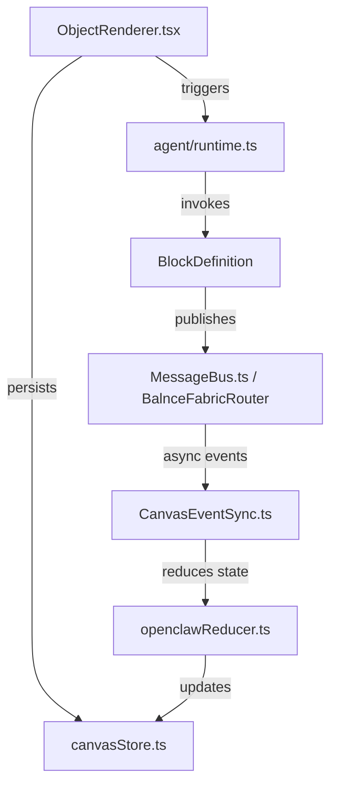

# Agentic Canvas Architecture: Current State Analysis

This document provides a detailed technical analysis of how blocks and nodes are defined, rendered, managed, and executed within the Balnce AI Infinite Creative Canvas.

---

## 1. Core Architecture Answers

### 1. Where canvas blocks/nodes are defined?

- **Backend schemas & metadata**: Defined via the `BlockDefinition` interface in [protocol.ts](file:///Users/zacharyschenkler/icmaster/packages/core/src/block/protocol.ts). Individual concrete block types are defined in [packages/core/src/blocks/creative/](file:///Users/zacharyschenkler/icmaster/packages/core/src/blocks/creative/) (e.g., [summarizer.ts](file:///Users/zacharyschenkler/icmaster/packages/core/src/blocks/creative/summarizer.ts) and [translator.ts](file:///Users/zacharyschenkler/icmaster/packages/core/src/blocks/creative/translator.ts)) and registered in [registry.ts](file:///Users/zacharyschenkler/icmaster/packages/core/src/block/registry.ts). Standard templates are dynamically instantiated in [factory.ts](file:///Users/zacharyschenkler/icmaster/packages/core/src/block/factory.ts).
- **Frontend visual representations**: Defined in [packages/imagination-canvas-kit/src/components/blocks/](file:///Users/zacharyschenkler/icmaster/packages/imagination-canvas-kit/src/components/blocks/) (e.g., [AgentBlock.tsx](file:///Users/zacharyschenkler/icmaster/packages/imagination-canvas-kit/src/components/blocks/AgentBlock.tsx), [OpenClawBlock.tsx](file:///Users/zacharyschenkler/icmaster/packages/imagination-canvas-kit/src/components/blocks/OpenClawBlock.tsx)). These are registered under a unified registry catalog in [BlockRegistry.ts](file:///Users/zacharyschenkler/icmaster/packages/imagination-canvas-kit/src/contracts/BlockRegistry.ts) and initialized in the entrypoint file [index.ts](file:///Users/zacharyschenkler/icmaster/packages/imagination-canvas-kit/src/index.ts).

### 2. Where block state is stored?

- **Spatial & Spatial Metadata**: Managed on the frontend via a Zustand store in [canvasStore.ts](file:///Users/zacharyschenkler/icmaster/packages/imagination-canvas-kit/src/state/canvasStore.ts). The store holds objects (`Record<string, CanvasObject>`), connections (`CanvasConnection[]`), and bindings (`CanvasBinding[]`), persisting them to browser LocalStorage under the key `"iem-canvas-storage"`.
- **Execution Runtime Outputs**: Maintained as transient in-memory states in [runtimeState.ts](file:///Users/zacharyschenkler/icmaster/apps/web/src/nodes/workflow/runtimeState.ts) within the `runtimeState` variable. This transient state resets upon page reloads.

### 3. Where block rendering happens?

- **Spatial Canvas Nodes**: Rendered in [ObjectRenderer.tsx](file:///Users/zacharyschenkler/icmaster/packages/imagination-canvas-kit/src/components/ObjectRenderer.tsx), which handles layout positioning, mouse dragging, and connection handles rendering. It loads the node view dynamically using the frontend `BlockRegistry`.
- **Immersive Workspace Layouts**: Managed in [ImmersiveBlockModal.tsx](file:///Users/zacharyschenkler/icmaster/packages/imagination-canvas-kit/src/components/ImmersiveBlockModal.tsx), providing a split workspace when expanded. The left sidebar houses either a `ChatComponent` or the parameter-editor [BlockInspector.tsx](file:///Users/zacharyschenkler/icmaster/packages/imagination-canvas-kit/src/components/BlockInspector.tsx). The right workspace renders the full-screen interactive view via [AgnosticRenderShell.tsx](file:///Users/zacharyschenkler/icmaster/packages/imagination-canvas-kit/src/components/AgnosticRenderShell.tsx).

### 4. Whether blocks have persistent runtime identity?

- **Yes**. Each block on the canvas is assigned a unique `id` (e.g. UUID) saved inside the Zustand canvas store. Backend catalog metadata uses static DNS-style string IDs (e.g. `iem.core.summarizer`).

### 5. Whether blocks can receive events?

- **Yes, structurally supported but not fully wired**. The frontend uses [CanvasEventSync.ts](file:///Users/zacharyschenkler/icmaster/packages/imagination-canvas-kit/src/state/CanvasEventSync.ts) to buffer asynchronous `OpenClawBlockEvent` events at 60fps, collapsing updates into single-pass render updates via [openclawReducer.ts](file:///Users/zacharyschenkler/icmaster/packages/imagination-canvas-kit/src/state/openclawReducer.ts).
- **Gap**: The real-time subscription connection to the `@iem/core` Message Bus is commented out inside `CanvasEventSync.ts` as a placeholder ("BREADCRUMB (A2A Message Fabric)").

### 6. Whether blocks can emit events?

- **Yes**. Backend blocks publish events through the `BalnceFabricRouter` (in [router.ts](file:///Users/zacharyschenkler/icmaster/packages/core/src/fabric/router.ts)), mapping legacy publications via [MessageBus.ts](file:///Users/zacharyschenkler/icmaster/packages/core/src/bus/MessageBus.ts) into v2 `BalnceEnvelope` schemas.

### 7. Whether blocks have input/output ports?

- **Yes**. Defined as Zod schemas `input` and `output` inside [protocol.ts](file:///Users/zacharyschenkler/icmaster/packages/core/src/block/protocol.ts).
- Visually represented as left (input) and right (output) drag handles in [ObjectRenderer.tsx](file:///Users/zacharyschenkler/icmaster/packages/imagination-canvas-kit/src/components/ObjectRenderer.tsx).
- Connection input value propagation is resolved in [inputResolution.ts](file:///Users/zacharyschenkler/icmaster/apps/web/src/nodes/workflow/inputResolution.ts) via `getNodeInputs` which picks matching output properties from connected parent nodes.

### 8. Whether blocks can call tools or APIs?

- **Yes**. The `agent` property in backend blocks is an `MCPToolBinding` which exposes an `invoke(input: unknown)` method. This method imports the global `agentRuntime` instance (in [runtime.ts](file:///Users/zacharyschenkler/icmaster/packages/core/src/agent/runtime.ts)) to communicate with Google Gemini or run workflow logic.

### 9. Whether blocks can create artifacts?

- **Yes**. Blocks specify what they produce via the `produces: string[]` parameter. During runtime executions, the result is saved directly into `object.metadata.outputs`.

### 10. Whether blocks have an inspector/debug trace?

- **Yes**. Real-time execution status is tracked via the block's `status` attribute (e.g. `thinking`, `running`, `complete`, `error`, `waiting-for-user`). Detailed configuration editing is done via [BlockInspector.tsx](file:///Users/zacharyschenkler/icmaster/packages/imagination-canvas-kit/src/components/BlockInspector.tsx). Event envelopes carry standard tracing telemetry (`traceId`, `runId`).

---

## 2. Codebase Architecture & File Mapping

### Critical Files Involved

- **Backend & Logic Layer**:
  - [packages/core/src/block/protocol.ts](file:///Users/zacharyschenkler/icmaster/packages/core/src/block/protocol.ts) — Base types & Zod contracts.
  - [packages/core/src/block/registry.ts](file:///Users/zacharyschenkler/icmaster/packages/core/src/block/registry.ts) — Block registrations & maps.
  - [packages/core/src/blocks/creative/summarizer.ts](file:///Users/zacharyschenkler/icmaster/packages/core/src/blocks/creative/summarizer.ts) — Concrete agent execution logic.
  - [packages/core/src/agent/runtime.ts](file:///Users/zacharyschenkler/icmaster/packages/core/src/agent/runtime.ts) — LLM execution runtime wrapper.
  - [packages/core/src/bus/MessageBus.ts](file:///Users/zacharyschenkler/icmaster/packages/core/src/bus/MessageBus.ts) — Compatibility bus wrapper.
  - [packages/core/src/fabric/router.ts](file:///Users/zacharyschenkler/icmaster/packages/core/src/fabric/router.ts) — Balnce event fabric routing.
- **Frontend & Rendering Layer**:
  - [packages/imagination-canvas-kit/src/contracts/index.ts](file:///Users/zacharyschenkler/icmaster/packages/imagination-canvas-kit/src/contracts/index.ts) — Type schemas for spatial entities.
  - [packages/imagination-canvas-kit/src/components/ObjectRenderer.tsx](file:///Users/zacharyschenkler/icmaster/packages/imagination-canvas-kit/src/components/ObjectRenderer.tsx) — Canvas absolute rendering.
  - [packages/imagination-canvas-kit/src/components/ImmersiveBlockModal.tsx](file:///Users/zacharyschenkler/icmaster/packages/imagination-canvas-kit/src/components/ImmersiveBlockModal.tsx) — Split panel workspace layout.
  - [packages/imagination-canvas-kit/src/components/BlockInspector.tsx](file:///Users/zacharyschenkler/icmaster/packages/imagination-canvas-kit/src/components/BlockInspector.tsx) — Inspector properties layout.
  - [packages/imagination-canvas-kit/src/state/canvasStore.ts](file:///Users/zacharyschenkler/icmaster/packages/imagination-canvas-kit/src/state/canvasStore.ts) — Zustand state persistence.
  - [packages/imagination-canvas-kit/src/state/CanvasEventSync.ts](file:///Users/zacharyschenkler/icmaster/packages/imagination-canvas-kit/src/state/CanvasEventSync.ts) — Asynchronous event batch sync to spatial view.
  - [apps/web/src/nodes/workflow/runtimeState.ts](file:///Users/zacharyschenkler/icmaster/apps/web/src/nodes/workflow/runtimeState.ts) — In-memory execution state store.

---

## 3. Gap Analysis (What Exists vs. What is Missing)

| Feature / capability  | What Exists                                                            | What is Missing                                                                                   |
| :-------------------- | :--------------------------------------------------------------------- | :------------------------------------------------------------------------------------------------ |
| **Block Definitions** | Zod input/output schemas, static metadata, reverse-DNS naming.         | Unified registration hook between backend definition and frontend views.                          |
| **State Persistence** | Zustand handles local storage serialization for spatial parameters.    | Multi-user backend-synced database states for block execution results.                            |
| **Event Routing**     | In-process transport and envelope wrappers exist in `core/src/fabric`. | Active message bus connection on the frontend to drive block status live.                         |
| **Port Wiring**       | Handles visually render, validation check runs.                        | Edge connection triggers (i.e. running a block doesn't auto-trigger downstream connected blocks). |
| **Artifacts**         | Simple JSON objects written to `metadata.outputs`.                     | Formalized versioning, formatting previews, and cloud sandbox file storage.                       |
| **Inspector/Trace**   | Property lists and basic status tags (`idle`, `thinking`).             | Execution timelines, token usage diagnostics, and visual system prompt debug logs.                |

---

## 4. Places to Add Runtime Behavior

1. **Frontend Event Subscription**:
   - **Where**: [CanvasEventSync.ts](file:///Users/zacharyschenkler/icmaster/packages/imagination-canvas-kit/src/state/CanvasEventSync.ts) (line 29).
   - **Behavior**: Uncomment the `messageBus` subscription block to allow the frontend to receive real-time updates directly from agent execution events in Hono/fastapi backends.
2. **Batch State Modification**:
   - **Where**: [canvasStore.ts](file:///Users/zacharyschenkler/icmaster/packages/imagination-canvas-kit/src/state/canvasStore.ts).
   - **Behavior**: Implement the missing `batchUpdateObjects(patches: Record<string, Partial<CanvasObject>>)` action in the Zustand store to allow `CanvasEventSync` to successfully apply buffered status changes without crashing.
3. **Execution Edge Triggers**:
   - **Where**: `runNode` method in [AtlasNode.tsx](file:///Users/zacharyschenkler/icmaster/apps/web/src/nodes/AtlasNode.tsx) or equivalent execution launchers.
   - **Behavior**: Upon successful block execution, traverse downstream connections resolved in `inputResolution.ts` to trigger dependent blocks automatically.

---

## 5. Potential Risks & Recommended Implementation Path

### Risks

- **React Render Storms**: Synchronously flushing real-time agent streams directly to the React tree will trigger rendering bottlenecks. The batching buffer in `CanvasEventSync` must be preserved.
- **State Incoherence**: Persisting local state in localStorage while execution state lives in-memory can cause mismatch states upon browser tab refreshes.

### Recommended Implementation Path

1. **Define missing state updates**: Add `batchUpdateObjects` to `canvasStore.ts`.
2. **Wire the Message Bus**: Connect the frontend `CanvasEventSync` to the real `@iem/core` Message Bus.
3. **Formalize Artifacts & Traces**: Standardize properties in `CanvasObject` metadata for debug traces and execution latency logs.
